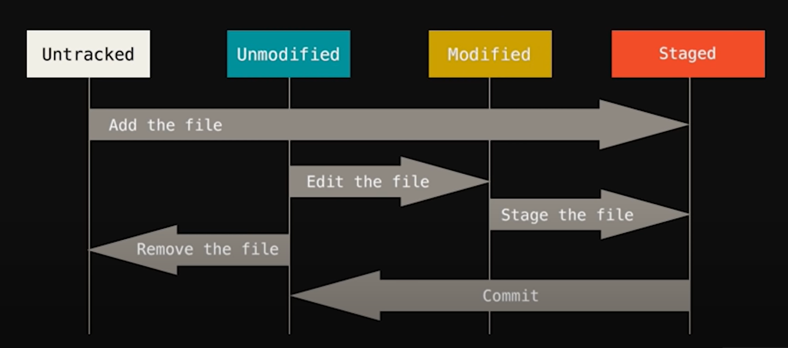

# Git Stages

1. **Untracked:**
    - Git is not tracking this file.
    - Git won't record changes for such files (Ex. Log files, newly addd files that yet to be tracked).
2. **Staged:**
    - These files will be tracked. Only those files are added in Staging area, which are to be committed.
    - Commit can be considered as snapshot of a file.
    - After commit git has recorded changes in the committed files.
    - After commit files move to unmodified area.
    - Staging area is there to re-review the changes that are to be comitted.
3. **Unmodified:**
    - Git has recorded changes in the file.
4. **Modified:**
    - Changes made in unmodified (committed) file.
    - Again the changes would be staged and committed.
    - So, the file will move in Staged area then in unmodified area.

