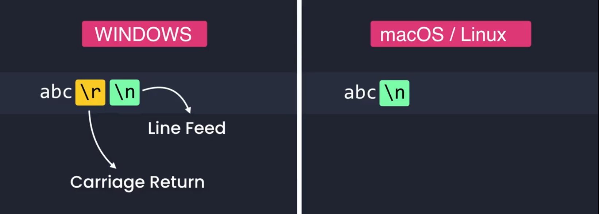
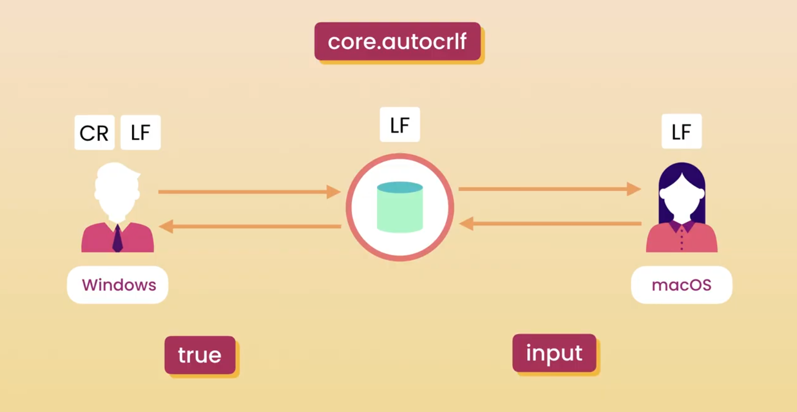

# Configuring Git:

- The first time we use/install Git on a machine, we need to specify few configuration settings.
- **Settings:**
    - Name
    - Email
    - Default Editor
    - Line Ending
- All these configuration settings can be applied at 3 levels
- **Levels:**
    - System: Applicable to all users of the current machine.
    - Global: Applicable to all Repos of current user.
    - Local: Applicable to current repository.
- So, we can have different settings for different repositories or different projects.

## Configuring username and password
| Command                                                | Description                      |
|--------------------------------------------------------|----------------------------------|
| `git config --global user.name "[firstName lastName]"` | Associate a username with commit |
| `git config --global user.email "[email]"`             | Associate an email with commit   |
| `git config --global user.name`                        | Displays associated username     |
| `git config --global user.email`                       | Displays associated email        |

## Configuring VSCode as default editor

- If not set explicitly, vim is the default editor

| Command                                         | Description                      |
|-------------------------------------------------|----------------------------------|
| `git config --global core.editor "code --wait"` | Setting VSCode as default editor |

- VSCode must be already added to the PATH.
- `code` refers to the vscode command, as it is already added to the path.
- `--wait` flag tells the terminal to wait until the new vscode instance is closed. 

All the configuration settings are stored in the **.gitconfig** file.

| Command                  | Description                              |
|--------------------------|------------------------------------------|
| `git config --global -e` | Opens .gitconfig file in default editor. |

## Configuring End Of Lines

- In Windows End of Lines is marked with two special characters `\r\n` (carriage return and line feed).
- While in MacOs and Linux End of Lines are indicated with `\n` (line feed).

- If End Of Lines is not handled properly, it may cause problems. To prevent this `core.autocrlf` property should be configured.

| Command                                   | Description                               |
|-------------------------------------------|-------------------------------------------|
| `git config --global core.autocrlf true`  | End of Lines configuration for Windows.   |
| `git config --global core.autocrlf input` | End of Lines configuration for Mac/Linux. |

- Let's say there are two collaborator working on a same Repo. And one is a Windows user while other is MacOS user.
- **Windows user:**
    - When the user wants to push his code to the repo, git should remove carriage return (`\r`) from End Of Lines
    - Similarly, when he wants to check out code from the repo, git should add carriage return (`\r` ) to end of lines.
    - To achieve this, `core.autocrlf` should be set to true.
- **MacOs/ Linux user:**
    - When the user checks out the code from repo, the user should not have carriage return (`\r`) in End of Lines. So, git should not alter End Of Lines.
    - When the user pushes code to the repo, git should remove carriage return (`\r`) from End of Lines, if it accidentally got added.
    - To achieve this, `core.autocrlf` should be set to input; which means git should modify End of Lines only while storing code into the repo.
