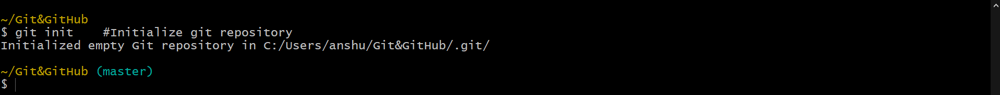

# Initializing and Cloning a Repository

| Command           | Description                                                  |
|-------------------|--------------------------------------------------------------|
| `git init`        | Initialize an existing directory as a Git repository         |
| `git clone [url]` | Retrieve an entire repository from a hosted location via URL |

- while initializing a **.git** folder gets created. This is a hidden folder where all the changes are saved.
- the command `ls -a` we show this git sub directory.

