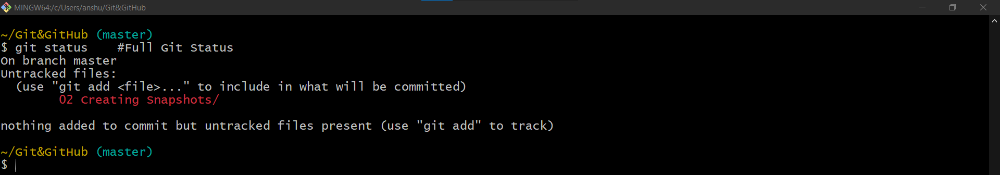
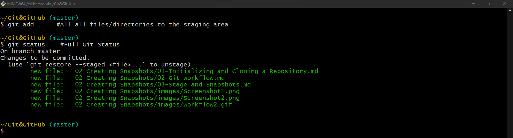
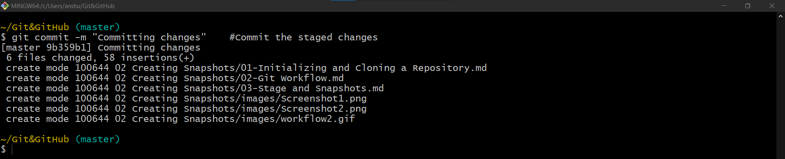

# Stage and Snapshots

Git does not track files automatically we have to explicitly specify files to be tracked by Git.\
Even when a new repository is initialized with `git init`, in project that already as several files, Git will only track them, when we add them explicitly..

The `git status` command can be run to see the status of the **Working Directory** and **Staging Area**.

- The above command shows untracked folders containing untracked files, that needs to be staged explicitly.

## Staging files

- Git does not automatically start tracking changes in file. The file needs to be staged explicitly.

| Command                         | Description                                                        |
|---------------------------------|--------------------------------------------------------------------|
| `git add <file>`                | To add a file to staging area                                      |
| `git add <file1, file2>`        | To add multiple files to staging area                              |
| `git add <directory>`           | To add a directory to staging area                                 |
| ` git add *.txt`                | To add files with certain patterns to the staging area (like .txt) |
| ` git add -A`   or   `git add .` | To add all files and directories to the staging area      |

## Committing changes

| Command                         | Description                                                                                                                                                    |
|---------------------------------|----------------------------------------------------------------------------------------------------------------------------------------------------------------|
| `git commit -m "commitMessage"` | Commits the staged changes with the specified commitMessage.                                                                                                   |
| `git commit`                    | Opens default editor to provide the commit message, then the commit is done. Preferred when long description is to be added along with the commit message. |

## Best Practices for committing the code:
- The commits should not be too big or too small. we shouldn't be committing every time we change a file, on the other hand we shouldn't also be waiting to implement a feature end-to-end before committing.
- The commit message should be meaningful.
- Commits can be treated as checkpoints, where each commit should represent the state of the project at that point in time.
- Each commit should represent a logically separate change set. i.e: Do not do too many things in a commit, each commit should have single type of work.
- Ex: If you are fixing a bug, and you found a typo, instead of committing both together they should be committed separately; one commit for bugfix another for typo.