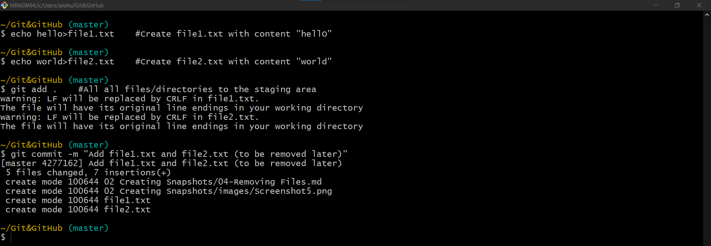
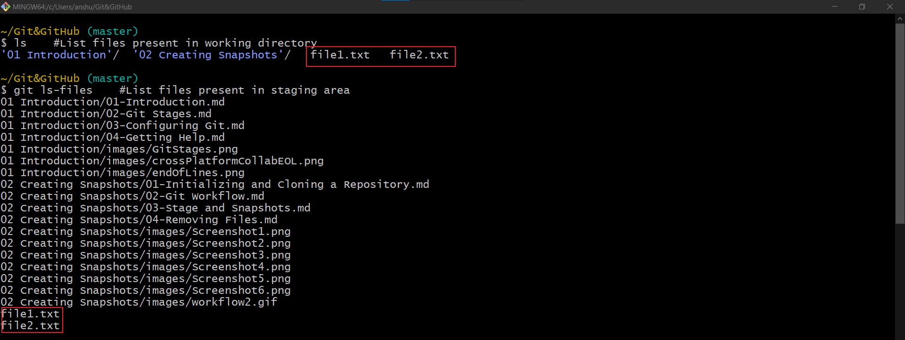
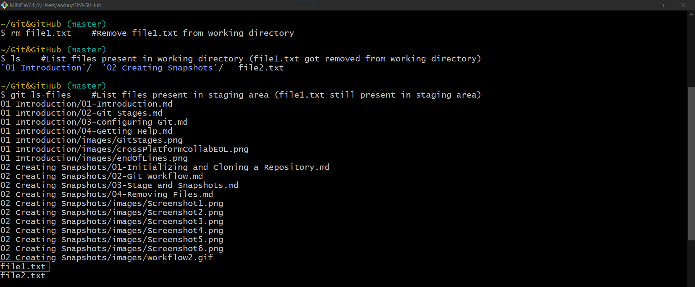
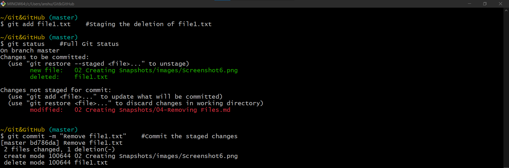
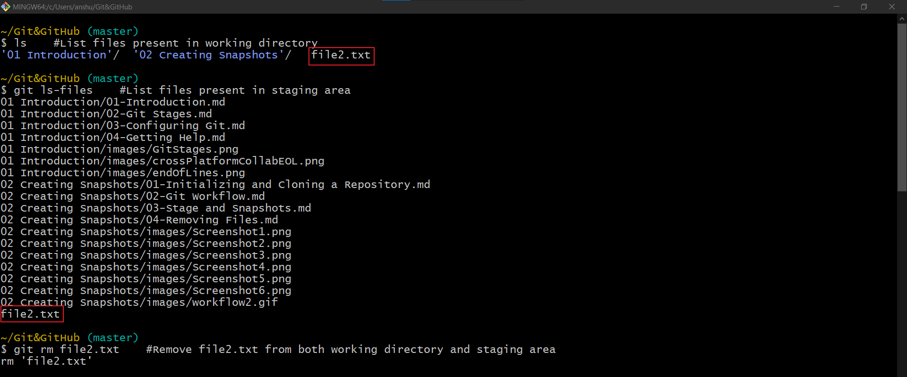
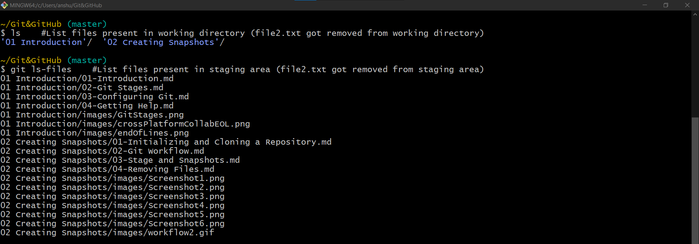
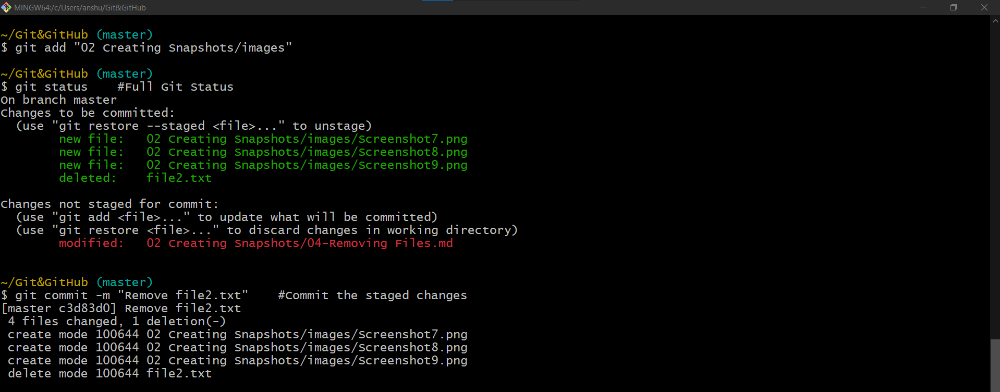

# Removing Files

- Temproarily committing two files `file1.txt` and `file2.txt` that is to be removed later from the project.

- First, deleting the file in working directory then staging the deletion.

- So, to remove a file we have to remove it from both working directory and staging area. 
- This can be done in single go as:

| Command             | Description                                                                   |
|---------------------|-------------------------------------------------------------------------------|
| `git rm "fileName"` | To remove specified file from working directory as well as from staging area. |

## Removing files only from the staging area

| Command                         | Description                                                                                                           |
|---------------------------------|-----------------------------------------------------------------------------------------------------------------------|
| `git rm --cached fileName`      | To remove specified file only from the staging area; the file won't be removed from the working directory             |
| `git rm --cached -r folderName` | To remove specified folder recursively from the staging area; teh folder won't be removed from the working directory. |