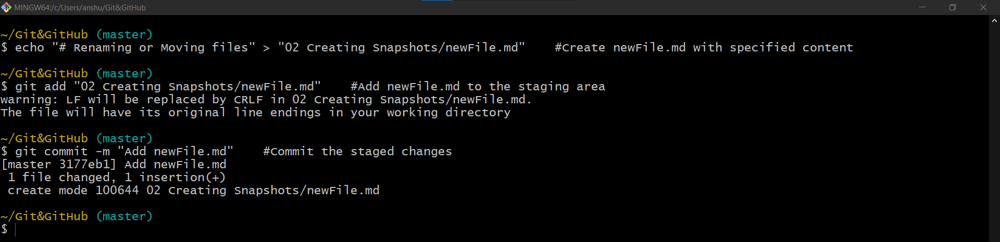
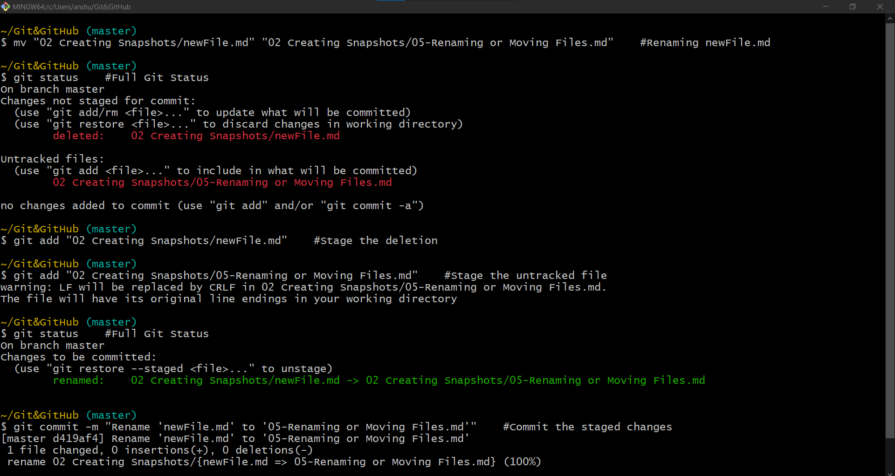

# Renaming or Moving files




- So, to rename a file, rename it in working directory then stage two types of changes addition of new untracked and deletion of old file.
- This can be done in single go as:

```shell
# To move/rename a file in both working directory and staging area
>git mv "02 Creating Snapshots/newFile.md" "02 Creating Snapshots/05-Renaming or Moving Files.md"
```
- The changes are applied to both working directory and staging area.


| Command                  | Description                                                  |
|--------------------------|--------------------------------------------------------------|
| `git mv oldFile newFile` | To rename a file in both staging area and working directory. |
