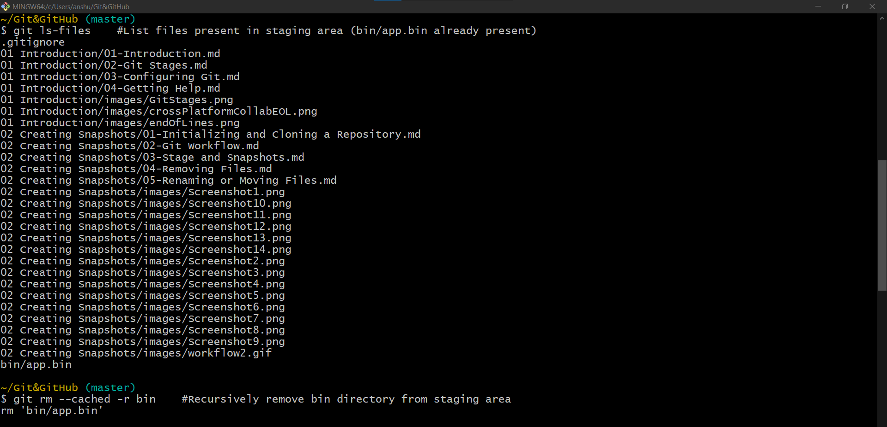

# Ignoring Files
- Some files of a project needs to be ignored; i.e: should not be tracked.
- Ex.: log files, binary files (that gets generated as a result of compilation).
- Adding such files will only grow the size of repo, without adding any value to it.
- The files/folders that needs to be ignored should be mentioned in the `.gitignore` file.

- This works only if the file is not already added in the repo. i.e: if a file is already added in the repo and then added into `.gitignore` file;
Git is not going to ignore that file as the file is already being tracked for changes and added into the staging area.
- To achieve this apart from adding it into `.gitignore` file, it should also be removed from the staging area for next commits.
- Removing file only from staging area
    - `git rm --cached fileName`  --> To remove a file from staging area.
    - `git rm --cached -r folderName` --> To recursively remove a folder from staging area.

 
 
