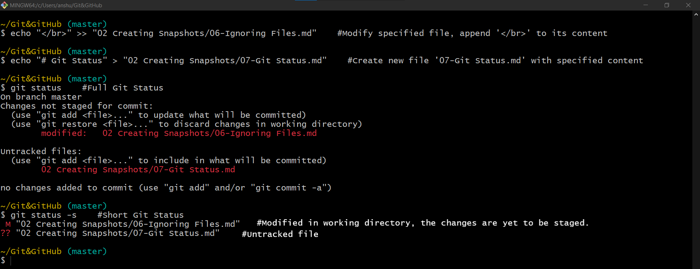
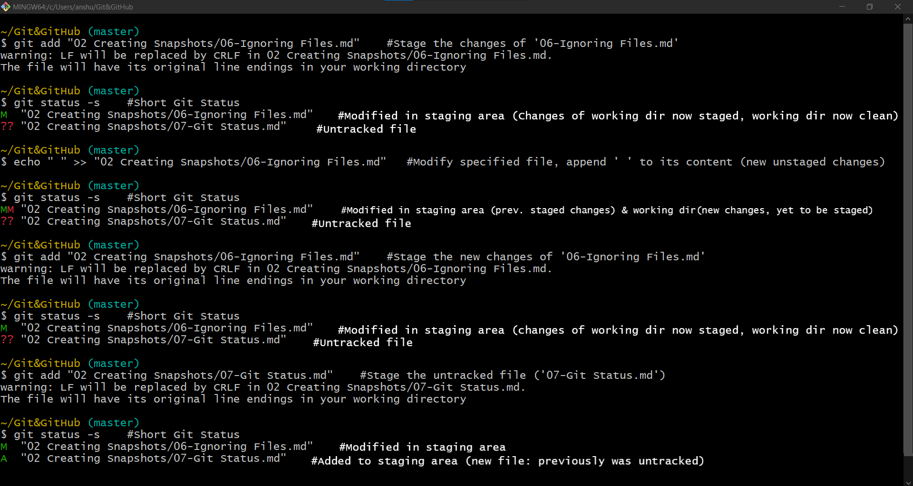

# Git Status

In the short-format, the status of each path is shown as one of these forms
```shell
XY PATH
OR
XY ORIG_PATH -> PATH
```
- The status is returned in the second form only if there has been some rename or copy operation. 
- The `ORIG_PATH` denotes the actual location from where the renamed or copied contents came from. 
- `XY` is a two−letter status code, where `X` represents status of the file in the staging area and `Y` represents status of the file in the working directory. 
- The following table lists the possible values for X and Y.


| Indicator	 | Interpretation       |
|------------|----------------------|
| `‘ ’`	     | Unmodified           |
| `M`        | 	Modified            |
| `A`        | Added                |
| `D`	     | Deleted              |
| `R`	     | Renamed              |
| `C`	     | Copied               |
| `U`	     | Updated but unmerged |

- The status code, ??, represents an untracked file.


