# Viewing Staged and Unstaged changes

- The git diff command is used to view changes. This can include changes between commits, branches, files, our working directory, or many other situations.

| Command             | Description                                                                                                       |
|---------------------|-------------------------------------------------------------------------------------------------------------------|
| `git diff --staged` | Compares the staging with the last commit. (staged changes) <br/> diff of what is staged but not yet commited     |
| `git diff`          | Compares working directory with the staging area. (unstaged changes) <br/> diff of what is changed but not staged |

- `ProgLant.txt` contains list of programming languages.

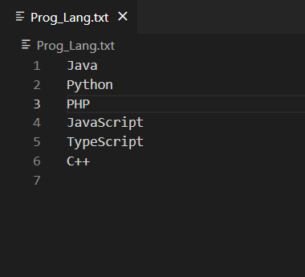

- Staging and committing the file.

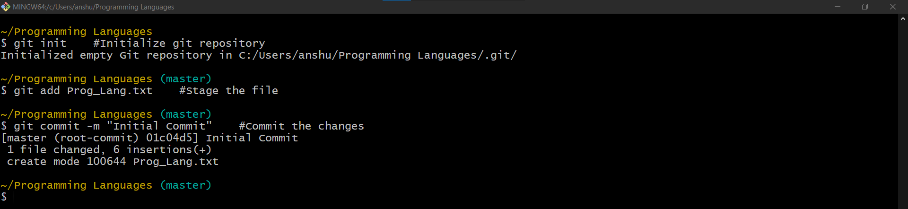

- Replacing "PHP" with "Kotlin" in working directory.

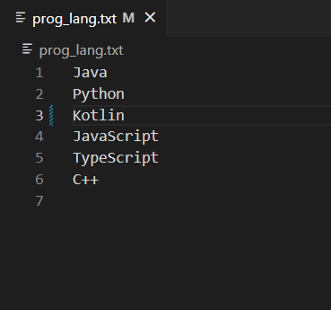

- viewing the unstaged changes.

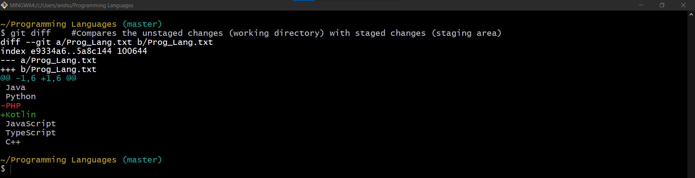

- The same can be viewed in vs-code if it is configured as default difftool:
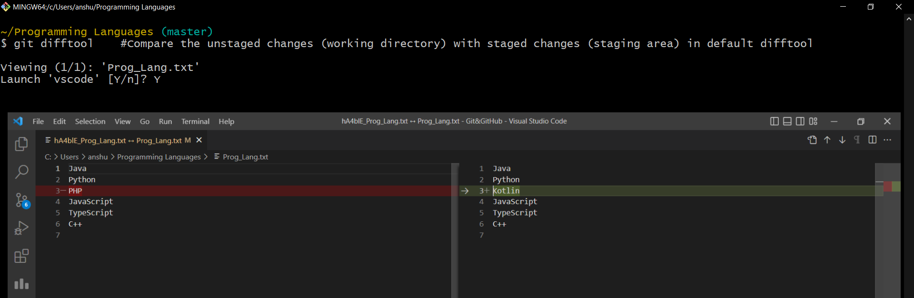


- However, once the changes are staged, `git diff` won't show anything. This is because `git diff` only shows the changes that are not yet staged.

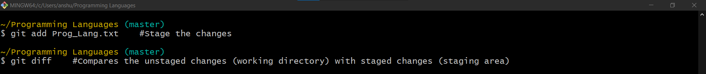

- viewing the staged changes.

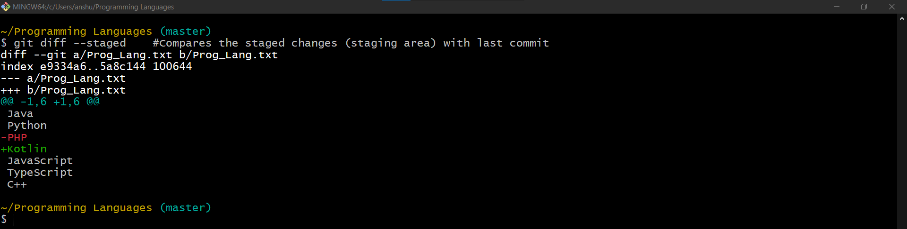
- The same can be viewed in vs-code if it is configured as default difftool:
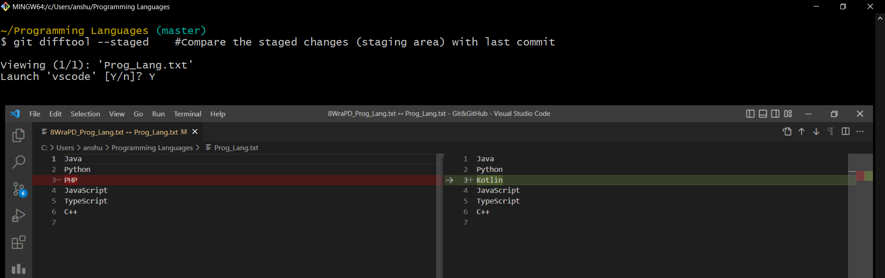

- However, once the changes are committed, `git diff --staged` won't show anything. This is because `git diff --staged` only shows the changes that staged but not yet committed.

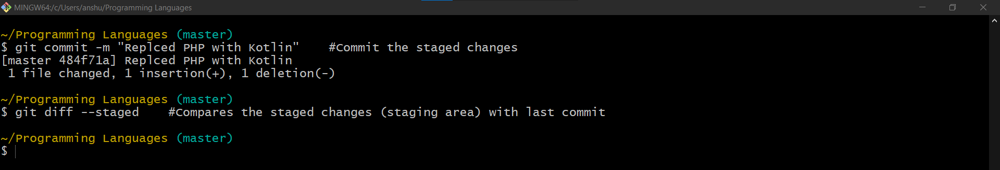

## Understanding the `git diff` or `git diff --staged` output

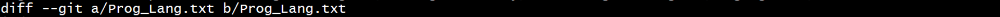
- The first line shows the files which are being compared. 
- we are comparing two copies of the same file, the first copy is the old copy (last commit/staging area); while the second copy is the newer copy (staging area/working dir).
- i.e: comparing last commit with staging area or comparing staging area with working dir.
- Often this will be different versions of the same file. 
- The `a/Prog_Lang.txt` and `b/Prog_Lang.txt` represent the different versions of the file.


- The next line shows some file metadata. 
- The first two numbers, e9334a6 and 5a8c144 represent the hashes of the files being compared. 
- The last number, 100644, represents the mode of the file
- This specific number means that this is an ordinary file.

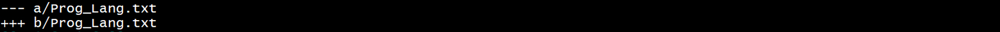
- The next two lines are the markers. 
- The `--- a/Prog_Lang.txt` means that the first file will be represented with a `—` sign.
- The `+++ b/Prog_Lang.txt` means that the second file will be represented with a `+` sign.

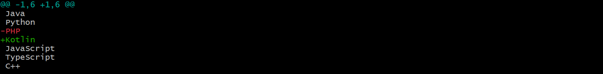
- The final part is called a chunk. The chunk shows a portion of the file that was modified. 
- If only a few lines are changed in a file, git is not going to show the entire file; instead it will
  divide the file in few chunks and will show changes in those chunks. Every chunk will have a header.
- Multiple chunks can be displayed, depending on how many changes were made.
  - 
  - The first line of the chunk is the header. This is the header with some information about what parts of the file has been changed.
  - The first set of numbers, -1, 6 mean that in the first file, 6 lines are shown, starting from line 1. 
  - The second set of numbers, +1, 6 mean that in the second file, 6 lines are shown, starting from line 1.
- Finally, we can see the changes in the chunk. 
- The text in white represents text that has not been changed. 
- The text in red represents deletion of text in newer version.
- The text in green represents addition of text in newer version.
- Changes in old copy is indicated by - sign, while changes in new copy is indicated by a + sign.
- The `-PHP` shows the line that came from the first file. 
- The `+Kotlin` shows the line that came from the second file.
 
## Configuring VSCode as Diff tool
- To do so, we need to instruct terminal that we will be using vscode as our default diff tool.

```shell
# Providing a name (vsvode) to default diff tool.
>git config --global diff.tool vscode
```

```shell
# Configuration to launch vscode as diff tool
>git config --global difftool.vscode.cmd "code --wait --diff $LOCAL $REMOTE"
```

- VSCode must be already added to the PATH.
- `code` refers to the vscode command, as it is already added to the path.
- `--wait` flag tells the terminal to wait until the new vscode instance is closed.
- `--diff` specifies vscode instance will be launched in diff mode.
- `$LOCAL` placeholder for old copy of file.
- `$REMOTE` placeholder for new copy of file.

```shell
# To open .gitconfig file to verify the changes.
>git config --global -e
```

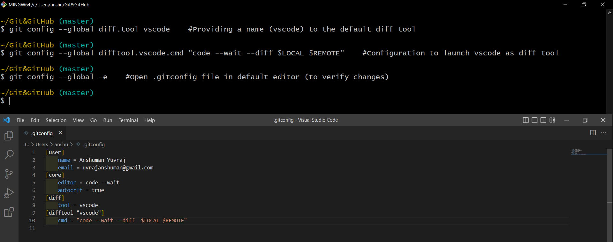

```shell
# To view unstaged changes in vscode instance (compares working directory with the staging area).
>git difftool
```
- In prev. section where we used `git diff` to compare changes, it can be replaced with `git difftool` to view the changes in vs-code.


```shell
# To view staged changes in vscode instance (compares staging area with last commit).
>git difftool --staged
```

- In prev. section where we used `git diff --staged` to compare changes, it can be replaced with `git difftool --staged` to view the changes in vs-code.


