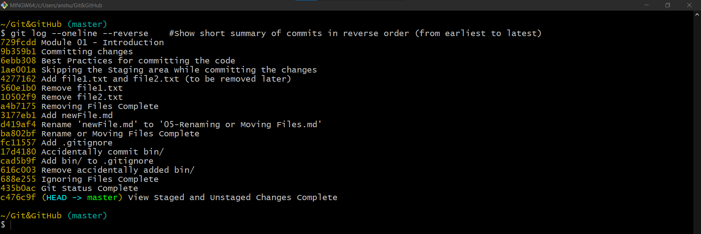

# Viewing History

| Command                       | Description                                                                                                                                                    |
|-------------------------------|----------------------------------------------------------------------------------------------------------------------------------------------------------------|
| `git log`                     | Shows verbose commit history from latest to earliest. <br/> Shows commit Id, Author (username, email) and Date time along with commit message for each commit. |
| `git log --oneline`           | Shows short summary of commits having only commit Id and one line commit messages from latest to earliest.                                                     |
| `git log --oneline --reverse` | Shows short summary of commits in reverse order. i.e: earliest to latest.                                                                                      |
| `git log -p -n`               | Shows last **n** commit along with the changes in those commits. **n** should be replaced with any valid number of commits.                                    |

## `git log`


Each commit has a unique identifier, and hexadecial, 40 character that git generates automatically.

```shell
commit 3e3c6c3fced4e94579e7c506e742b480bd2c682c
```
Next to the first commit we have **`(HEAD -> master)`**:

- `HEAD` is a reference to the current branch.
- `main` beeing the current branch.

## `git log --oneline`


## `git log --oneline --reverse`



## `git log -p -n`

