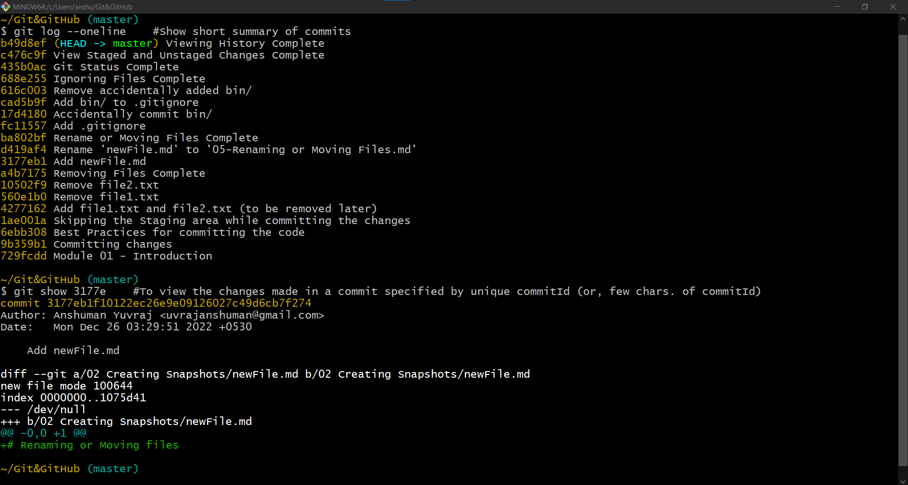
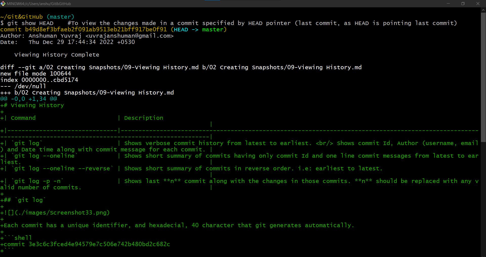
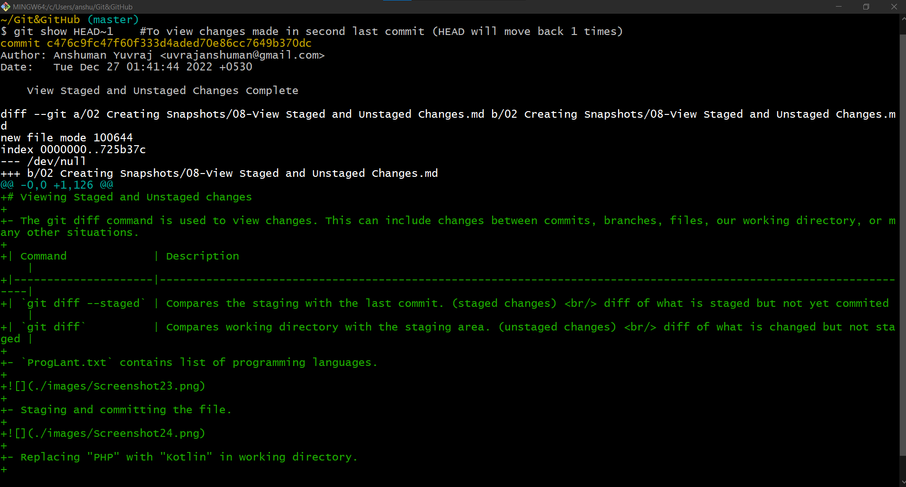
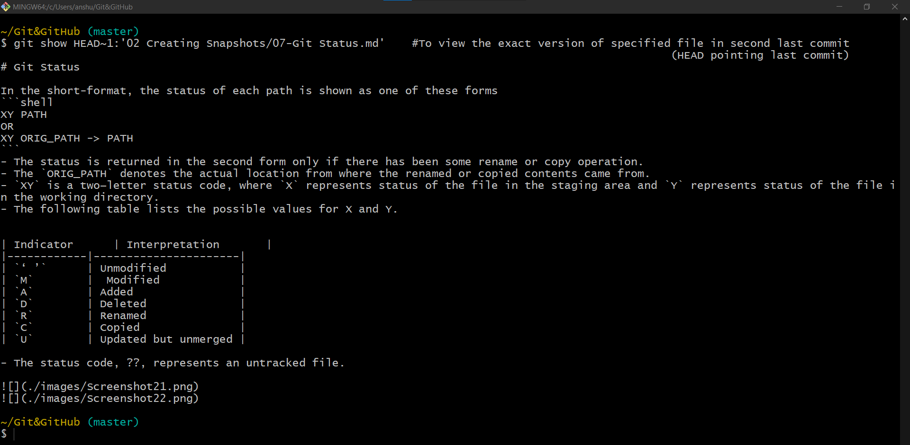
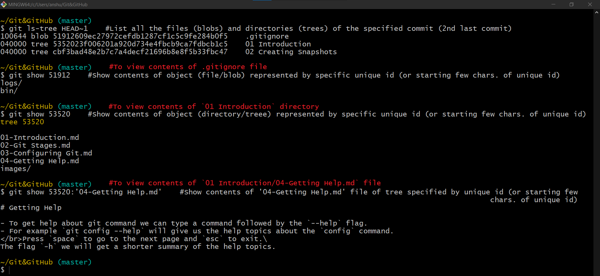

# Viewing a commit

## Show a commit

To view what was changed in a commit we can use the `git show` command. We have to pass the commit as an argument. There are two ways to reference a commit:

1. By the unique identifier, for example `git show 3e3c6c3`. We don't have to type all the characters, we can type fewer character as long they are unique.
2. Another way is using the `HEAD` pointer. `HEAD` is in front of the last commit, so we can type how many steps we want to go back `git show HEAD~2`, for example 2.

This will produce a similar output to `git diff`.







| Command             | Description                                                                                         |
|---------------------|-----------------------------------------------------------------------------------------------------|
| `git show commitId` | To view content of commit with specified unique id.                                                 |
| `git show HEAD`     | To show last commit using HEAD pointer. (HEAD pointing to last commit)                              |
| `git show HEAD~1`   | To show 2nd last commit, 1 can be replaced with any number and HEAD will move back that many times. |

- All the above commands shows the difference/changes that has been made in a specific commit.

## Show exact version of a file in a commit

**To Show the final version of a specific file in a commit**



| Command                                         | Description                                                                                          |
|-------------------------------------------------|------------------------------------------------------------------------------------------------------|
| `git show HEAD~1:"fullPathOfTheFile"`           | To view the exact version of the specified file in this commit, instead of just viewing the changes. |
| `git show "uniqueIdOfTree":"fullPathOfTheFile"` | To view the exact version of the specified file in the tree specified by unique id                   |

- git show command only shows the differences, what is changed.

## Show all the files and directories in a commit

| Command                        | Description                                                           |
|--------------------------------|-----------------------------------------------------------------------|
| `git ls-tree HEAD~1`           | Shows all the files and directory of the specified commit.            |
| `git ls-tree "uniqueIdOfTree"` | Shows all the files and directory of the tree specified by unique id. |

- The file system can be treated as a tree containing files and sub-tress.
- Files are represented as blob along with unique id. And directories are represented as trees along with their unique id.
- All of these are objects stored in the git database and can be viewed easily using git show command passing their unique id.
```shell
# To show object with specified unique id
git show 1dc33
```
- In earlier show command we were using commitId but here using object's unique id.
- Git Objects:
    - Commits
    - Blob (Files)
    - Trees (Directories)
    - Tags


