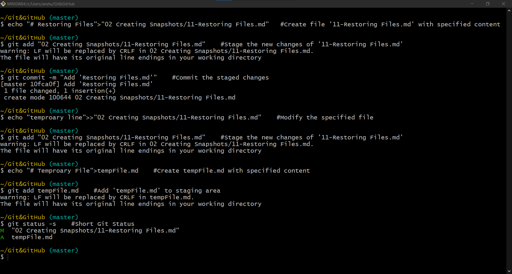
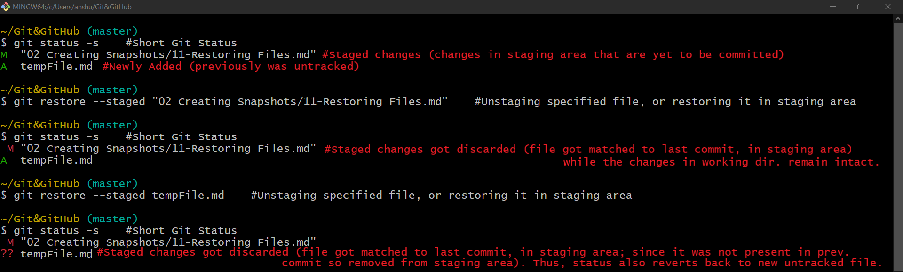
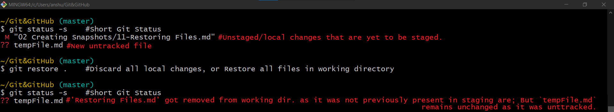
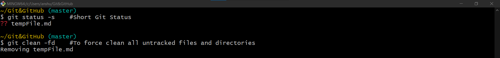

# Restoring Files



- The git restore command takes the copy from next environment. 

## Restoring Files in Staging area / Unstaging Files
- In case of staging environment, the next environment is the previous commit. So, when a file is restored in staging area, git takes
the version of file present in last commit and puts/copies it to the staging area.
- And, in case the file was not present in last commit, the file will be removed from the staging area as well. It will still be present in working directory though.

| Command                         | Description                                                                                                        |
|---------------------------------|--------------------------------------------------------------------------------------------------------------------|
| `git restore --staged fileName` | Unstaging specified file <br/> The file gets restored in staging area. i.e: matched to one present in last commit. |


- undoing the `git add` operation

One should always review the stuff you have in staging area before making a commit.\
Let say the latest changes of `11-Restoring Files.md` should not go into next commit.\
So we will undo the add operation.



Not going to see green M against `11-Restoring Files.md` \
All the changes we had in staging area are now in the working directory <br> <br>
`tempFile.md` file did not existed in last commit. so, Git removes it from staging area and takes it back to previous state which is new untracked.

# Restoring Files in Working directory / Discarding Local Changes

- In case of working directory, Git restores the file(s) from next environment. i.e: staging area.
- So, the file gets matched to the one present in staging area. In other words the local changes gets discarded.
- And, in case the file is untracked (i.e: not present in staging area); git doesn't know the previous version of the file. So, it will remain unchanged.

| Command                   | Description                                                                                                                                                                                                            |
|---------------------------|------------------------------------------------------------------------------------------------------------------------------------------------------------------------------------------------------------------------|
| `git restore fileName`    | Discards local changes for specified file. <br/> The file gets matched with on present in the staging area.<br/>But the file must be tracked to get restored, untacked files can not be restored in working directory. |
| `git restore file1 file2` | Restore multiple files in the working directory.                                                                                                                                                                       |
| `git restore .`           | Discard all local changes. <br/> Restore all files in the working directory (except untracked files).                                                                                                                  |

- But, the files must be tracked to be restored, untracked files of working directory can not be restored.



The changes of `11-Restoring Files.md` got removed/discarded as it got matched to the previous version present in staging area
<br> <br>
But `tempFile.md` is still present as it new untracked file so git has not been tracking it
<br>
In case of new files (untracked files), Git does not change anything, because it does not know where to get a previous version of this file, it does not exist in the **Staging Area** or **Repository**. <br> 

**To remove untracked files :** </br>
we can use `git clean` with the `-fd` flags

| Command         | Description                                         |
|-----------------|-----------------------------------------------------|
| `git clean -fd` | To force clean all untracked files and directories. |

- `-f` force, The operation is risky so, -f flag needs to be used.
- `-d` remove whole directories.


>If we run this command without the flags on untracked files we will get a fatal error:

```shell
fatal: clean.requireForce defaults to true and neither -i, -n, nor -f given; refusing to clean
```

- This is a way of git to warns us that this can not be undone.


