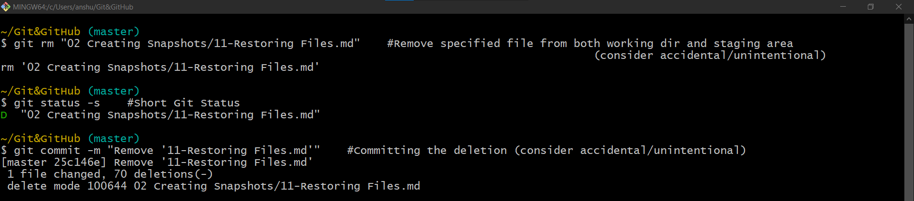
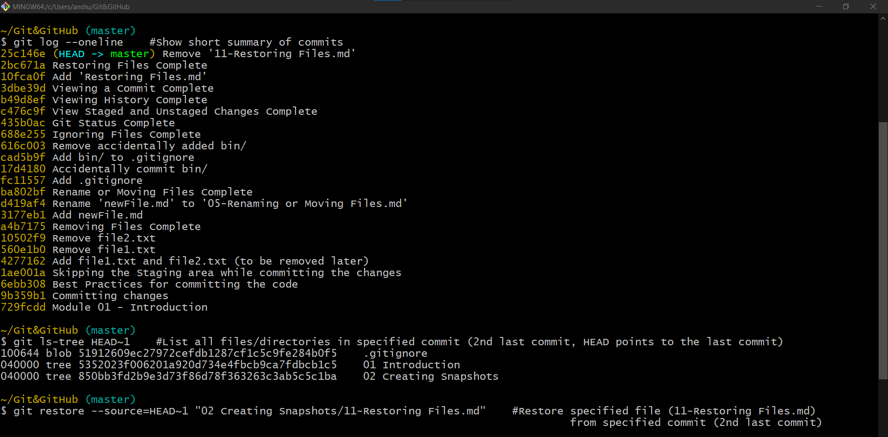

# Restoring a File to an Earlier Version

Once git tracks a file it stores every version of that file in the database. With Git there are two way to restore a file to it's earlier version :

1. Restore a file to previous version
2. Undoing a commit

Herein we are going to look at restoring a file.\
For example: consider accidental deletion of a file and committing the deletion as well

A file can be restored using `git restore`.\
 By default git will restore a file from the next environment, so if the file we want to restore is in the **Working Directory**, Git will restore it from the **Staging Area**, and if it is in the **Staging Area** Git will restore it from the repository, or last commit.

In this case with `git restore --source=HEAD~1 "02 Creating Snapshots/11-Restoring File.md"`, we override the default behavior and restore the file from second last commit. 

The `git status` shows the recovered file marked as untracked.

