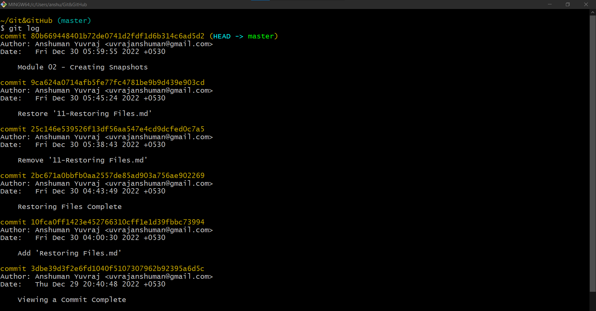
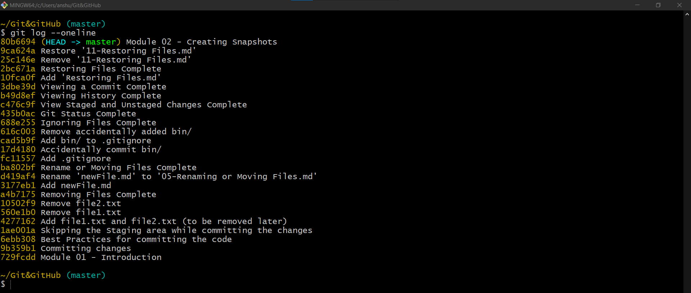
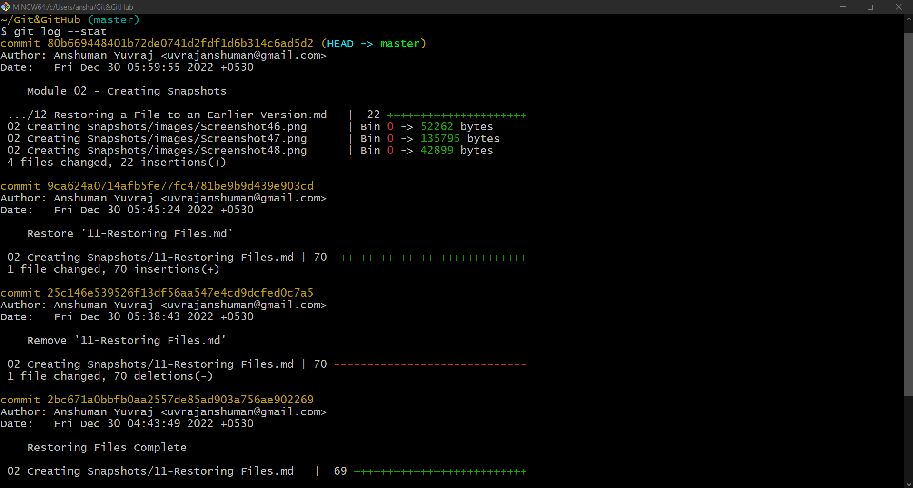
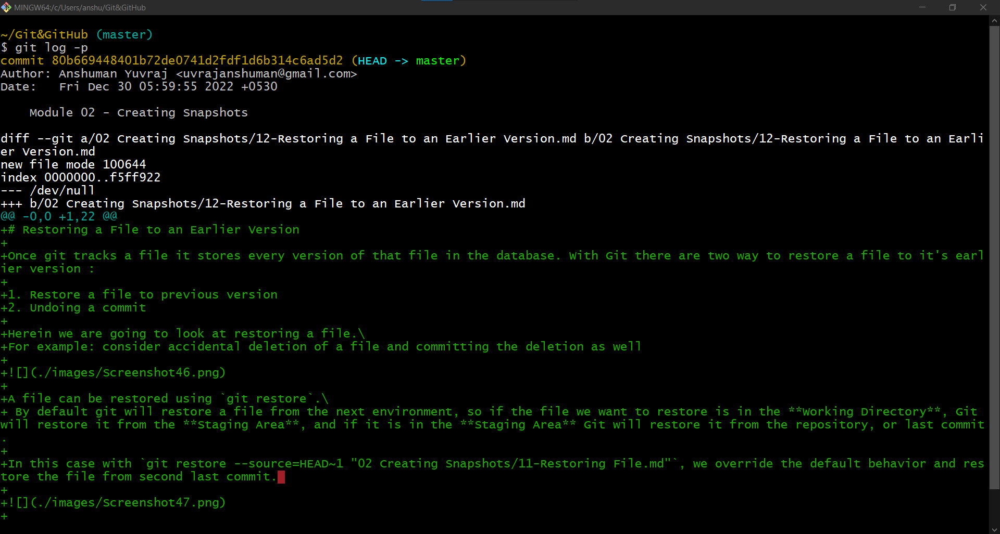
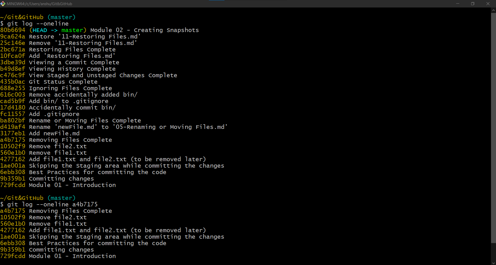
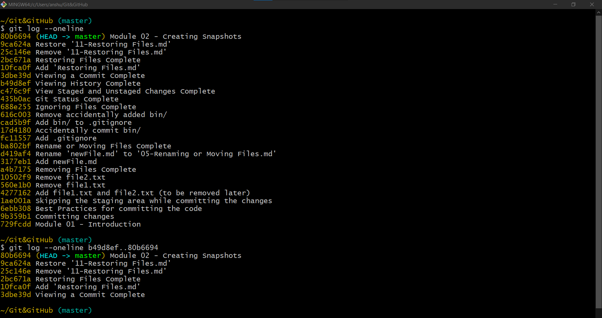

# Viewing the History

# Git log

- The git log command displays all of the commits in a repository’s history.
- By default, the command displays each commit’s:
  - Secure Hash Algorithm (SHA)
  - author
  - date
  - commit message



>There can be multiple pages of commits; so, pressing `space` will take to the next page or we can also use the up and down arrows to navigate and `q` to exit.

## Git Log Flags
- You can customize the information presented by git log using flags.
- These flags can be combined as well.

## `--oneline`
`git log --oneline`
- The --oneline flag causes git log to display
  - one commit per line
  - the first seven characters of the SHA
  - the commit message



## `--stat`
`git log --stat`
- The --stat flag causes git log to display
  - the files that were modified in each commit
  - the number of lines added or removed (changes) made in each modified file.
  - a summary line with the total number of files and lines changed



>There can be multiple pages of commits; so, pressing `space` will take to the next page or we can also use the up and down arrows to navigate and `q` to exit.

## `--patch` or `-p`
`git log --patch` <br>
or, the shorter version <br>
`git log -p`
- The --patch flag causes git log to display
  - the files that you modified
  - the location of the lines that you added or removed
  - the specific changes that you made
It shows the actual changes in the commits similar to `git diff`



>There can be multiple pages of commits; so, pressing `space` will take to the next page or we can also use the up and down arrows to navigate and `q` to exit.


## Start at a specific commit
  - To start git log at a specific commit, add the SHA:
  - `git log a4b7175`
  - This will display the commit with the SHA 7752b22 and all of the commits made before that commit. You can combine this with any of the other flags.



- This can also done using the `HEAD` pointer: `git log --oneline HEAD~17`

## Start and End at a specific commit
- `git log b49d8ef..80b6694`
- This will display the commit between the specified commit Ids.



- This can also be done using the `HEAD` pointer: `git log --oneline HEAD~6..HEAD`

## `--graph`
`git log --graph`
- The --graph flag enables you to view your git log as a graph. 
- It can also be combined  with --oneline option.

`git log --graph --oneline`

- The output would be similar to,

```shell
* 64e6db0 Update index.md
* b592012 Update Python articles (#5030)
* ecbf9d3 Add latest version and remove duplicate link (#8860)
* 7e3934b Add hint for Compose React Components (#8705)
* 99b7758 Added more frameworks (#8842)
* c4e6a84 Add hint for "Create a Component with Composition" (#8704)
*   907b004 Merge branch 'master' of github.com:freeCodeCamp/guide
|\  
| * 275b6d1 Update index.md
* |   cb74308 Merge branch 'dogb3rt-patch-3'
|\ \  
| |/  
|/|   
| *   98015b6 fix merge conflicts after folder renaming
| |\  
|/ /  
| * fa83460 Update index.md
* | 6afb3b5 rename illegally formatted folder name (#8762)
* | 64b1fe4 CSS3: border-radius property (#8803)
``` 
One of the benefit of using this command is that it enables you to get a overview of how commits have merged and how the git history was created.
