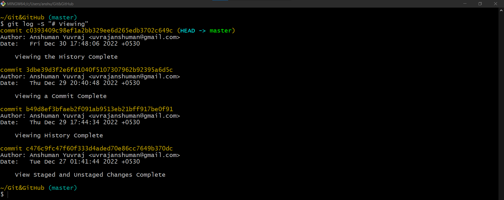

# Filtering the History

## By Amount

| Command        | Description                                       |
|----------------|---------------------------------------------------|
| `git log -<n>` | Limits the git log's output to first 'n' commits. |

Ex: 
- `git log -3` will limit the git log's output to last 3 commits.

## By Author

| Command                          | Description                                                                                                                                                              |
|----------------------------------|--------------------------------------------------------------------------------------------------------------------------------------------------------------------------|
| `git log --author="Author Name"` | Filters the commits by a particular user/authorName.  --author flag takes a regular expression and returns the list of commits made by authors matching that pattern |

Ex:
- `git log --oneline --author="Anshuman"` will display all commits whose author name incudes 'Anshuman'.
- `git log --author="@gmail.com"` will display all commits whose author name or email matches the provided pattern (@gmail.com)

## By Date and Time

- The commits can be filtered based on date and time.
- `--after` and `--before` arguments can be used to specify the date.

| Command                       | Description                                                |
|-------------------------------|------------------------------------------------------------|
| `git log --after="yy-mm-dd"`  | Displays all the commits made on or after the given date.  |
| `git log --before="yy-mm-dd"` | Displays all the commits made on or before the given date. |

 Ex:
- `git log --after="24-02-2023"` will display all commits made on or after 24-02-2023
- `git log --before="24-02-2023"` will display all commits made on or before 24-02-2023
- `git log --after="yesterday"` or `git log --before="yesterday"`
- `git log --after="one week ago"` or `git log --before="one week ago"`
- `git log --after="Two days ago"` or `git log --before="Two days ago"`
- `git log --after="one month ago"` or `git log --before="one month ago"`
- `git log --after="21 days ago"` or `git log --before="21 days ago"`

we can also track commits between two dates using combination of `--before` and `--after`
- `git log --after="2019-11-01" --before"2019-11-08"` or `git log --before"2019-11-01" --after="2019-11-08"`

## By Commit message

| Command                          | Description                                                                                                    |
|----------------------------------|----------------------------------------------------------------------------------------------------------------|
| `git log --grep="commitMessage"` | Displays all the commits that has specified commitMessage.   The value passed in --grep is case sensitive. |

Ex:
- `git log --grep="GUI"` will display all commits having 'GUI' in commit message.

## By modified line/content

| Command                      | Description                                                                                                                      |
|------------------------------|----------------------------------------------------------------------------------------------------------------------------------|
| `git log --S "modifiedLine"` | Displays all the commits that added/removed (modified) the line containing 'modifiedLine'. The 'modifiedLine' is case sensetive. |

Ex:
- `git log -S"hello()"` will display all commits which modified (added/removed) the line/line containing "hello()".
- `git log -S"hello()" --patch` when combined with --patch will show changes (similar to git diff) in commits as well.

## By modified file

| Command              | Description                                                    |
|----------------------|----------------------------------------------------------------|
| `git log "filePath"` | Displays all the commits where the specified file was modified |

Ex:
- `git log --oneline toc.txt` will display all the commits where this file 'toc.txt' was modified.
- `git log --oneline -- toc.txt` : In case ambiguity arises.
- `git log --oneline --patch -- toc.txt`: when combined --patch will show changes in filtered commits as well.

