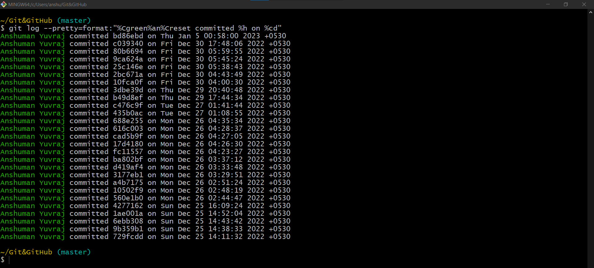
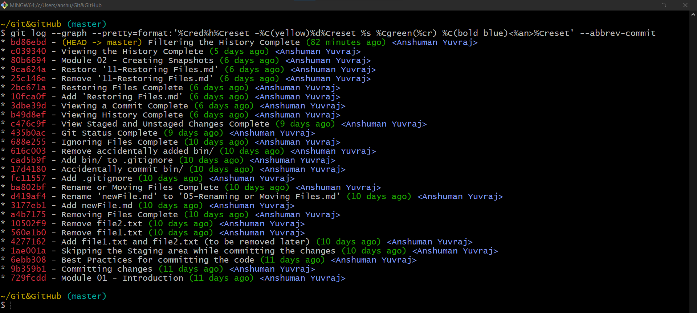

# Formatting the Log Output

## `git log --pretty=format:'formatString'`

- We can personalize the output of the log command with the option `git log --pretty:format:'formatString`.
- We must pass it a format string containing plain text combined with placeholder that will be replaced by Git with information about each commit. 
- [Git PRETTY FORMATS](https://git-scm.com/docs/pretty-formats) defines a list of all the place holders. We can also pass colors and colorize the output

Ex:

```shell
>git log --pretty=format:"%Cgreen%an%Creset committed %h on %cd"
```

- `%Cgreen` : Green color
- `%an` : Author name
- `%Creset` : Reset the color
- `%H` : Commit hash
- `%h` : Abbreviated form of commit hash
- `%cd` : Commit date



Sample pretty format:

```shell
>git log --graph --pretty=format:'%Cred%h%Creset -%C(yellow)%d%Creset %s %Cgreen(%cr) %C(bold blue)<%an>%Creset' --abbrev-commit

```

