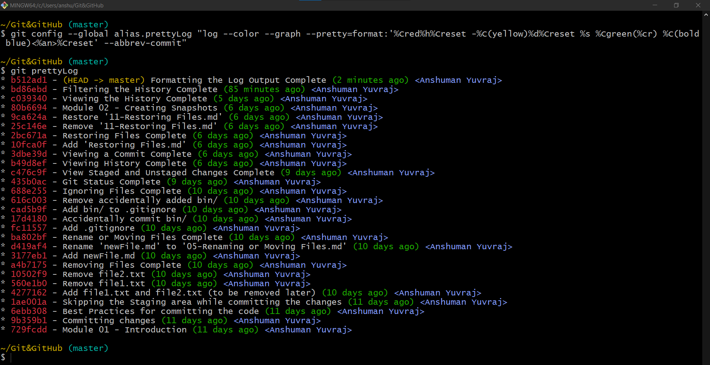

# Aliases

- Aliases can be created for git commands; and the commands can be executed directly using the alias.
- It helps in case of frequently used and very long commands
- We can set aliases for frequently used commands, so we do not have to type them in the long form everytime. 


Ex:

Creating an alias

```shell
>git config --global alias.prettyLog "log --graph --pretty=format:'%Cred%h%Creset -%C(yellow)%d%Creset %s %Cgreen(%cr) %C(bold blue)<%an>%Creset' --abbrev-commit"
```
- `--global` : to apply to all repo of current user
- `alias.prettyLog` : declaring the alias 'prettyLog'
- `"log --graph --pretty=format:'%Cred%h%Creset -%C(yellow)%d%Creset %s %Cgreen(%cr) %C(bold blue)<%an>%Creset' --abbrev-commit"` : git command to be mapped to alias 'prettyLog'

- Herein `prettyLog` got mapped as an alias of `log --graph --pretty=format:'%Cred%h%Creset -%C(yellow)%d%Creset %s %Cgreen(%cr) %C(bold blue)<%an>%Creset' --abbrev-commit`.

Executing the command using alias:

```shell
>git prettyLog
```


Another Ex:
- To create alias for command `git restore --staged`
```shell
git config --global alias.unstage "restore --staged"
``` 
- `git unstage` : executing git command using alias

## Removing an Alias

- Removing alias `prettyLog`

```shell
git config --global --unset alias.prettyLog
```

- Another way is to delete its entry directly from `.gitconfig` file (`git config --global -edit`: to open `.gitconfig` file in default editor)

| Command                                             | Description                                                                    |
|-----------------------------------------------------|--------------------------------------------------------------------------------|
| `git config --global alias.aliasName "gitCommand"`  | To create a git alias.                                                         |
| `git config --global --unset alias.aliasName`       | To remove a git alias.                                                         |