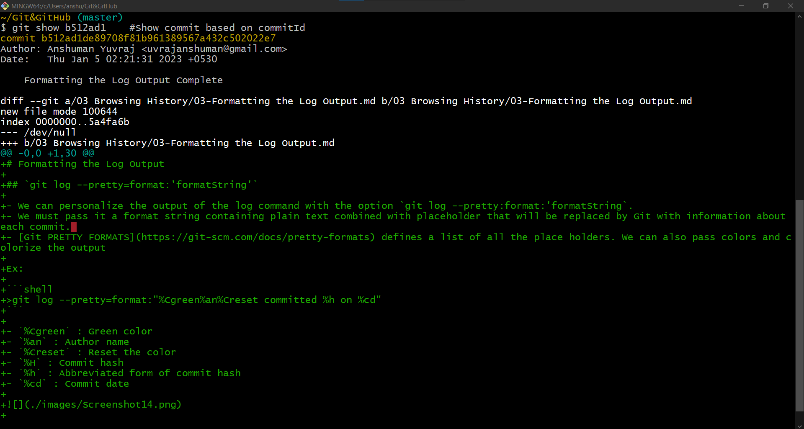
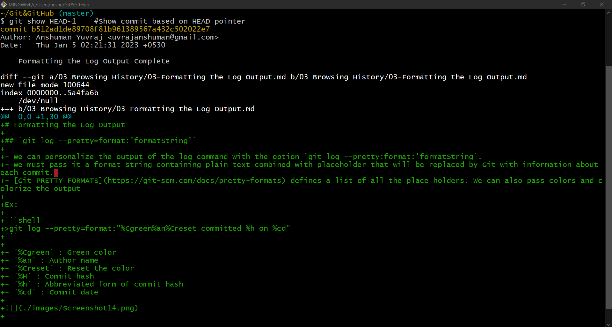
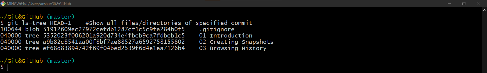
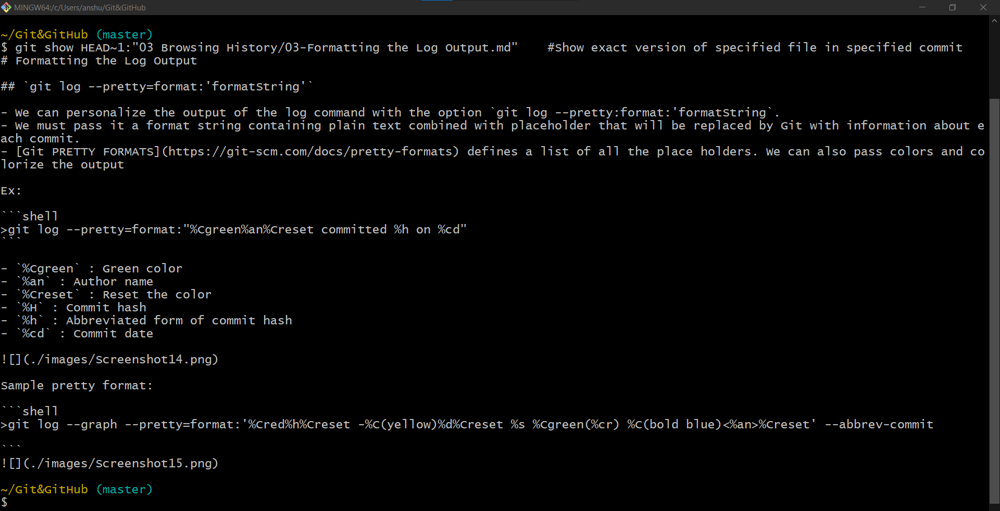
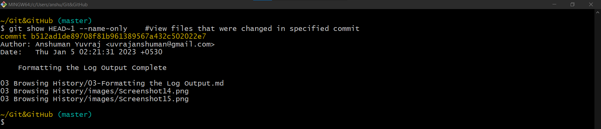
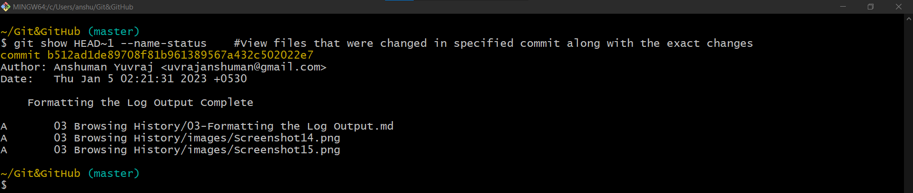

# Viewing a commit

- we can reference a commit in two ways
  1. using the commit id
  2. using the relative reference HEAD pointer

| Command                                              | Description                                                                    |
|------------------------------------------------------|--------------------------------------------------------------------------------|
| `git show commitId`   or   `git show HEAD~1` | Shows commit hash, Author, Date, commitMessage and diff of every file changed. |

`git ls-tree HEAD~1` : Shows all the files and directory of the specified commit

## Final version of a file

We can see the final version of a particular file in a particular commit with the `git show HEAD~n:<path to the file>`.  

| Command                                                                 | Description                                                                          |
|-------------------------------------------------------------------------|--------------------------------------------------------------------------------------|
| `git show HEAD~n:<path to the file>` or   `git show uniqueObjectId` | To show the exact version of file in specified commit, instead of viewing just diff. |

## Files changed in a commit `--name-only`

To view the files that were changed in a given commit we use `git show HEAD~n --name-only`

| Command                         | Description                                                                                                                      |
|---------------------------------|----------------------------------------------------------------------------------------------------------------------------------|
| `git show HEAD~1 --name-only`   | To view all the file names that are added or removed (modified) in the specified commit. does not shows the operation.           |

## Files changed in a commit `--name-status`

Using the option `--name-status`, we have a similar output than above but with information about the change in the file, like: if it was added, modified, deleted or renamed.

| Command                         | Description                                                                                                                      |
|---------------------------------|----------------------------------------------------------------------------------------------------------------------------------|
| `git show HEAD~1 --name-status` | To view all the file names that are added or removed (modified) in the specified commit along with exact action like M : Modified, A : Added so on. |

## Viewing the changes across commits

To see what has been changed across a range of commits we can use the `diff` command.  
For example `gif diff HEAD~2 HEAD`, will return all the changes between the two specified commits `HEAD~2` and `HEAD`.

We can add a particular file to that command to only see the specifiec changes made to that file, like `git diff HEAD~2 HEAD "03 Browsing History/04-Aliases.md"`

Like with the `log` command, we can pass `--name-only` and `--name-status` here to see the list of files that have been changed.

| Command                                  | Description                                                                                                       |
|------------------------------------------|-------------------------------------------------------------------------------------------------------------------|
| `git diff HEAD~2 HEAD`                   | To view the changes across two commits.                                                                           |
| `git diff HEAD~2 HEAD abc.txt`           | To view the changes in specified file across two commits.                                                         |
| `git diff HEAD~2 HEAD --name-only`       | To view all the file names that are changed/modified across two commits.                                          |
| `git diff HEAD~2 HEAD --name-status`     | To view all the names along with the modification type of the files that are changed/modified across two commits. |
