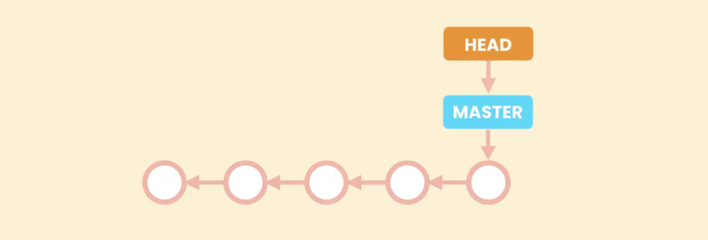
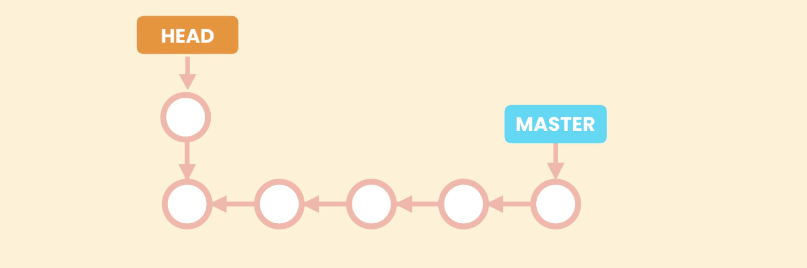
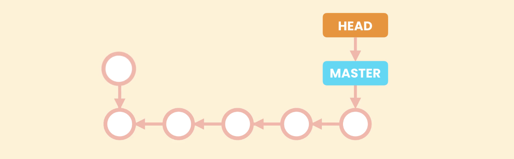

# Checking Out a Commit

When we need to see the complete project in a given point in time we can check out a given commit, and it will restore our **Working Directory** to that point in time. 

Thus, our working directory will look exactly same as the one present in earlier commit.

For example `git checkout 15c88a1`.

This will bring a warning:

```shell
>git checkout 15c88a1    #Check out commit specified by commitId
Note: switching to '15c88a1'.

You are in 'detached HEAD' state. You can look around, make experimental
changes and commit them, and you can discard any commits you make in this
state without impacting any branches by switching back to a branch.

If you want to create a new branch to retain commits you create, you may
do so (now or later) by using -c with the switch command. Example:

  git switch -c <new-branch-name>

Or undo this operation with:

  git switch -

Turn off this advice by setting config variable advice.detachedHead to false

HEAD is now at 15c88a1 Aliases Complete

```
**Summary:**

```shell
git checkout 15c88a1    #or, `git checkout HEAD~1` checking out specified commit

git log --oneline    #only the commits till current HEAD will be shown. (Master not shown, Detached HEAD state)

git log --oneline --all    #To view all the commits (Master and HEAD pointing different commits)

git checkout master    #Attaching HEAD pointer back to Master.
```

| Command                             | Description                                                                                                                |
|-------------------------------------|----------------------------------------------------------------------------------------------------------------------------|
| `git checkout commitId/HEADpointer` | To checkout to a commit specified by given commitId or HEAD pointer. <br/> Shows warning "you are in detached head state". |


## Detached HEAD state


- Each commit points to previous commit. This is how Git maintains the history.


- Every git repo has a default branch called Master. Git represents this branch using a pointer `Master`. we can have multiple branches.
- So, as we create new commits `Master` moves forward to point to the latest commit.


- Now, because multiple branches can be created. Git needs to know the current branch we are working on, this is done using a special pointer `HEAD`. <br> 
So, `HEAD` points to the current branch we are working on. In this case `Master`.

- So, as we create new commits these two pointer `Master` and `HEAD` move forward to point to the latest commit made.


- But when we checkout a commit, the `HEAD` pointer moves back to point to that commit. This is called detached `HEAD` state as `HEAD` is not attached to branch pointer `Master`.


- In this situation we should not create a new commit, we should only view our commits, as if a new commit is made there, that commit won't be reachable by any commit or pointer. 


- And, at some point we need to attach `HEAD` pointer back to branch like `Master`. This unreachable or dead commit will be deleted by Git to save space we will lose changes made in that commit.
- So, when in detached head state new commits should not be made.
