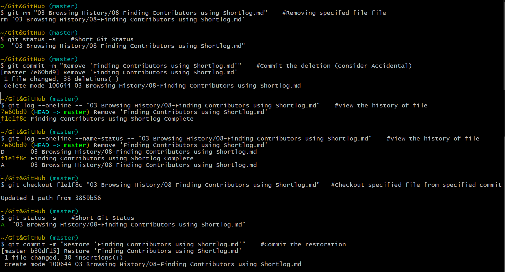

# Restoring a Deleted File

A deleted file can be restored from a previous commit, by using `git checkout` on that file from a previous commit.

For Example, 
- Here we deleted the `08-Finding Contributors using Shortlog.md` and committed the deletion.

- `git log --oneline --name-status -- "03 Browsing History/08-Finding Contributors using Shortlog.md"` displays the history of the file along with the change type.  
From here we found out the file got deleted in commit `7e60bd9` and it's latest version can be found in commit `f1e1f8c`. 

-  `git checkout f1e1f8c "03 Browsing History/08-Finding Contributors using Shortlog.md"` will checkout/restore the deleted file from commit `f1e1f8c`, in working directory as well as staging area.

| Command | Description |
|---------|-------------|
| `git checkout commitId/HEADPointer <filePath>` | Checkout/Restore specified file from specified commit. |
