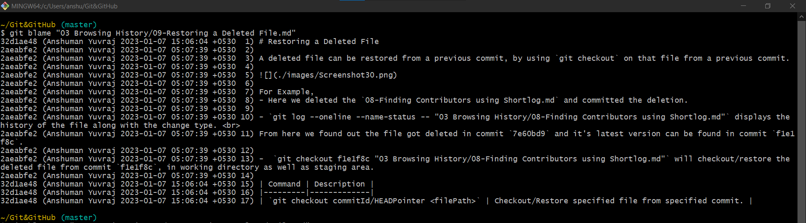

# Finding author of line using blame:

- As part of troubleshooting we can use blame tool to find out who has written that exact line of code.

## Git blame

- `git blame <filePath>` is a command to find the author of lines of code of specified file.

```shell
>git blame "03 Browsing History/09-Restoring a Deleted File.md"
```



For each line of code in the file we can see

1. The commit ---> 32d1ae48
2. The author ---> Anshuman Yuvraj
3. Date & Time (Timestamp) ---> 2023-01-07 05:07:39 +0530
4. Line number ---> 1
5. And the code it self ---> #Restoring a Deleted File.

## Git blame with email `-e`

- `git blame -e <filePath>` 
- `-e` flag can be used with git blame to provide email of author in the output.

```shell
>git blame -e "03 Browsing History/09-Restoring a Deleted File.md"
```


## Git blame filter by lines `-L`

- `git blame -L <startLineNo,endLineNo> <filePath>`
- `L` flag can be used to specify the range of lines of which we want to find author.

```shell
>git blame -L 1,9 "03 Browsing History/09-Restoring a Deleted File.md"
```
The above example will restrict the `git blame` output for Line ranging from 1 to 9.


| Command                                               | Description                                                                                |
|-------------------------------------------------------|--------------------------------------------------------------------------------------------|
| `git blame <filePath>`                                | To find the author of lines of codes of specified file.                                    |
| `git blame -e <filePath>`                             | To display author email instead of name in `git blame` output.                             |
| `git blame -L <startLineNo,endLineNo> <filePath>`     | To find author of specified Lines of code. <br> `-L` is used to specify the range of lines |
