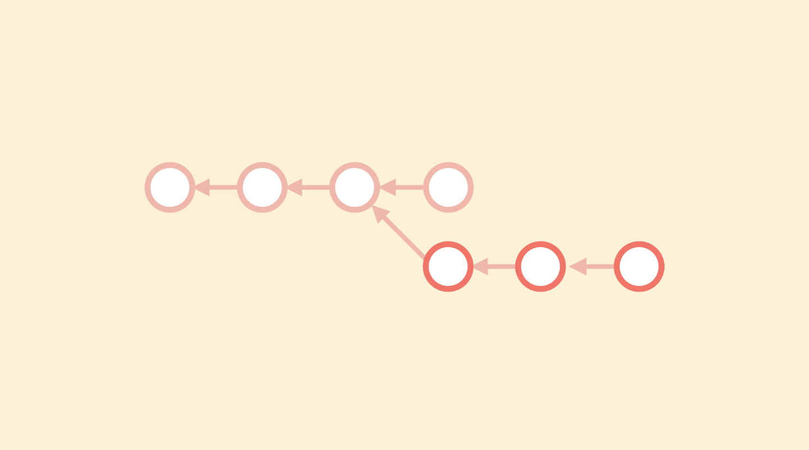
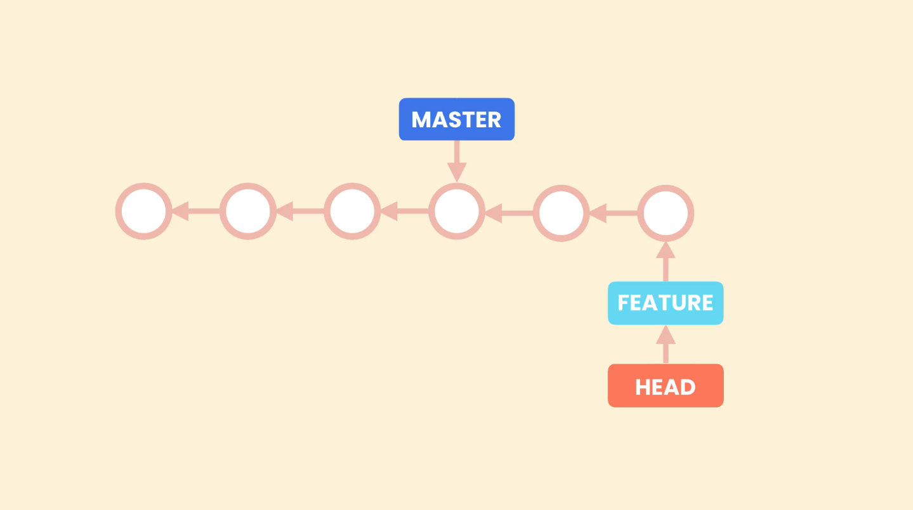

# Branching


- Branching allows us to diverge from main line of work and work on something else in isolation.
It can also be thought of as a separate isolated workspace.

- Branching allows to work on different work items (workspaces) without messing the main line of work. The main line is kept stable.
<br> And when the work in the new branch is completed, it can be merged into the main branch.

- Branching in git is quite fast and efficient unlike other version control systems like subversion.
Like in subversion whe we create a new branch, subversion takes a copy of working directory and makes in a new branch. This can take some time as each files need to be copied.<br>
while, in git a branch is represented by just a pointer to a commit.



- In git a branch is just a pointer to the commit. 
- The **Master** pointer points to the last commit in the main line of work and with each new commit git automatically moves it forward to
point to the latest commit.
- When we create new branch, git simply creates a new pointer pointing to the commit pointed by **Master** (last commit).
<br>And with each new commit in the new branch, the new branch pointer moves forward to point to the latest commit done in the new branch. But **Master** keeps on pointing to the last commit done in the main branch.<br>
In this way git knows the latest commit in both of the branches.
- When we switch back to master ,git matches our working directory to the commit that master points to. </br>
Thus, we always have a single working directory with multiple pointers.
- Git uses special pointer **HEAD** to know which branch we are currently working on.
- When we move to the new branch, **HEAD** starts pointing to the new branch pointer, else it keeps pointing the **Master**.<br>
So, moving into branches is done by just moving the **HEAD** pointer.


## Working with Branches

### Create new branch

`git branch <name-of-branch>` : To create a new branch.

```shell
~/Git&GitHub (master)
$ git branch demo-branch    #Create a new branch 'demo-branch'
```

### View Branches

`git branch` : To view all the available branches.

```shell
$ git branch    #View all branches
  demo-branch
* master
```

The `*` in front of the **_master_** means that at the moment we are in that branch. 
It is also possible to view the current branch with `git status`.

```shell
$ git status
On branch master
nothing to commit, working tree clean
```

### Switch branches

`git switch <name-of-branch>` : To switch to specified branch. <br>
It can also be done using `git checkout <name-of-branch>` (old command)

```shell
~/Git&GitHub (master)
$ git switch demo-branch    #Switch to 'demo-branch'
Switched to branch 'demo-branch'
```

### Rename a branch `-m`

`git branch -m <old-name> <new-name>` : To rename a branch.

```shell
~/Git&GitHub (demo-branch)
$ git branch -m demo-branch bugfix    #Rename 'demo-branch' to 'bugfix'
```

> we may have used dummy names for branches. But the branche name should be meaningful and should represent the work that is being performed on it.

### Commit to the new branch

```shell
~/Git&GitHub (bugfix)
$ git status -s    #Short Git status
 M "04 Branching/Branching.md"

~/Git&GitHub (bugfix)
$ git add '04 Branching/Branching.md'    #Stage the changes

~/Git&GitHub (bugfix)
$ git commit -m 'Working with branches'    #Commit to the new branch
[bugfix e3e348f] Working with branches
 1 file changed, 53 insertions(+)

```

When we commit to a branch this branch moves forward and the **_master_** branch stays where it is, this can be verified using `git log --oneline`. The **_HEAD_** pointer will be pointing to the new branch which is now ahead of **_master_**.

```shell
~/Git&GitHub (bugfix)
$ git log --oneline
e3e348f (HEAD -> bugfix) Working with branches
537ee9d (master) Branching Introduction
907f0e1 (tag: M-03) Module 03 - Browsing History
d028a00 Finding the Author of Line using Blame Complete
32d1ae4 Refactor 'Restoring a Deleted File'
2aeabfe Restoring a Deleted File Complete
b30df15 Restore 'Finding Contributors using Shortlog.md'
[...]
```
**Switching to master branch**
```shell
~/Git&GitHub (bugfix)
$ git switch master    #Switch to master
Switched to branch 'master'
```
If we switch back to **_main_** our **Working Directory** will be restored to that the commit at that point. The changes made in bugfix branch will not be visible in the master branch.

> `git switch -C <branch-name>` : To create a branch and switch to it as well.

**Viewing the git log in master branch**
```shell
~/Git&GitHub (master)
$ git log --oneline
537ee9d (HEAD -> master) Branching Introduction
907f0e1 (tag: M-03) Module 03 - Browsing History
d028a00 Finding the Author of Line using Blame Complete
32d1ae4 Refactor 'Restoring a Deleted File'
2aeabfe Restoring a Deleted File Complete
[...]
```
The mater is one commit behing the bugfix branch. so, when in master branch `git log --oneline` will only show commit log till master. But `--all` flag can be used to view the entire commit log.

```shell
~/Git&GitHub (master)
$ git log --oneline --all    #To view entire commit log
e3e348f (bugfix) Working with branches
537ee9d (HEAD -> master) Branching Introduction
907f0e1 (tag: M-03) Module 03 - Browsing History
d028a00 Finding the Author of Line using Blame Complete
32d1ae4 Refactor 'Restoring a Deleted File'
2aeabfe Restoring a Deleted File Complete
[...]
```

## Delete a brach `-d` or `-D`

`git branch -d <name-of-branch>` : To delete specified branch.

At some point in future when we are done making changes in bugfix we can merge it in the master branch and delete the bugfix branch.
The changes made in a branch remains confined to it unless merged.

To delete, first we need to change to a different branch usually ***master***, then we use the `-d` option, but if this branch has unmerged changes with ***master***, Git will throw an error warning us.

```shell
~/Git&GitHub (master)
$ git branch -d bugfix
error: The branch 'bugfix' is not fully merged.
If you are sure you want to delete it, run 'git branch -D bugfix'.
```

Although the forced deletion can be performed using `git branch -D bugfix`.

## Summary:

| Command                                                                           | Description                                 |
|-----------------------------------------------------------------------------------|---------------------------------------------|
| `git branch <name-of-branch>`                                                     | To Create a new branch.                     |
| `git branch`                                                                      | To view all the available branches.         |
| `git switch <name-of-branch>` <br>`git checkout <name-of-branch>` (old command)   | To switch to the specified branch.          |
| `git switch -C <name-of-branch>`                                                  | To create a new branch and switch to it.    |
| `git branch -m <old-name> <new-name>`                                             | To rename a branch.                         |
| `git branch -d <name-of-branch>`                                                  | To delete specified branch..                |
| `git branch -D bugfix`                                                            | To force delete specified branch..          |