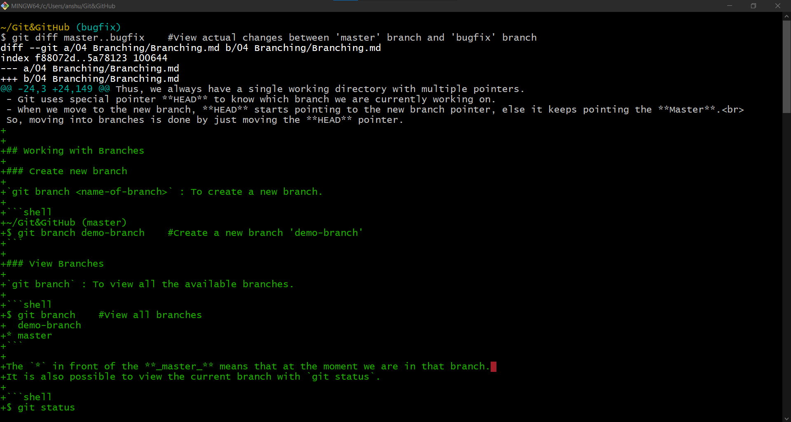

# Comparing Branches

At some point in future we will be merging the bugfix branch into master. But before doing so, we need to review the changes across these branches.

## List commit differences between branches

`git log <first-branch>..<second-branch>` : To list all the commits that are in `<second-branch>`, and not in `<first-branch>`

We can compare branches to see difference in commits between them. 

```shell
~/Git&GitHub (bugfix)
$ git log master..bugfix    #List all the commits that are in bugfix branch but not in master.
commit 17501bab8323bd768e36d0ff0984fe6f91fafbfd (HEAD -> bugfix)
Author: Anshuman Yuvraj <uvrajanshuman@gmail.com>
Date:   Wed Jan 11 03:06:38 2023 +0530

    working with branches Complete

commit e3e348f9508f7234db356721689237c0e9c41f09
Author: Anshuman Yuvraj <uvrajanshuman@gmail.com>
Date:   Wed Jan 11 02:39:07 2023 +0530

    Working with branches

```
- `--oneline` flag can also be applied for concise input.

## View actual changes between branches

`git diff <first-branch>..<second-branch>` : To view the actual changes between `<first-branch>` and `<second-branch>`.

To compare the actual changes between branches we use the `diff` command, like  `git diff main..bugfix-lesson` will produce an output just like the normal `diff`, but will comparing the two branches.


>There diff output can comprise of multiple pages; so, pressing `space` will take to the next page or we can also use the up and down arrows to navigate and `q` to exit.

- If we are in the ***master*** branch we do not need to specify it in the command, we can run `git diff bugfix`, this will have the same output. It will compare current branch with specified branch.

`--name-only` or `--name-status` flag can also be used with diff to view the name of modified file or to view the name of modified files along with modification type.

## Summary:

| Command                                   | Description                                                                         |
|-------------------------------------------|-------------------------------------------------------------------------------------|
| `git log <first-branch>..<second-branch>` | To list all the commits that are in `<second-branch>`, and not in `<first-branch>`  |
| `git diff <first-branch>..<second-branch>`| To view the actual changes between `<first-branch>` and `<second-branch>`.          |