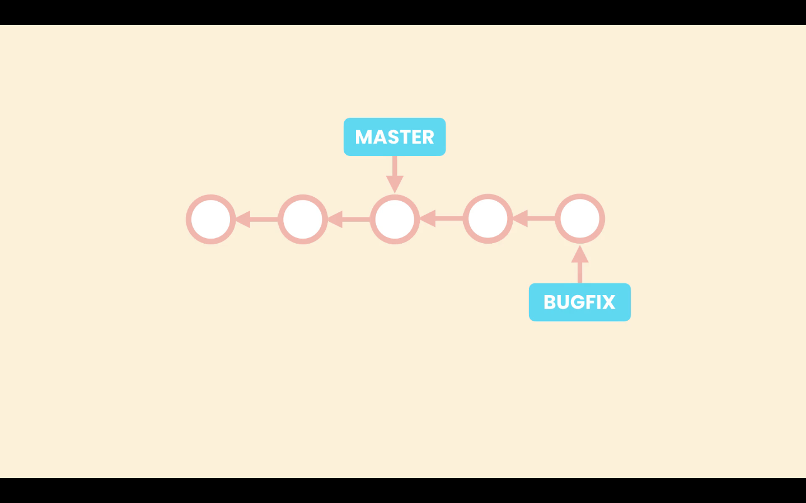

# Merging

Merging is about bringing the changes from one brach to another.

In Git we have two types of merges:

1. Fast-forward merges
2. 3-way mergers

## Fast-forward merges

- In git a branch is just a pointer to a commit. 
When we create new brach, let's call it ***bugfix***, from the ***master*** branch, both branches, ***master*** and ***bugfix***, will be pointing to the same commit.

- Then, when we switch to ***bugfix*** and start committing changes to it, the ***bugfix*** branch moves forward while the ***master*** branch stays at the same place. These branches have not diverged and there is a direct linear path between them.

- Now, when we need to bring changes from bugfix branch back to master branch. we will perform the merge operation. 
Since, there is no additional commit/changes after master which is not part of bugfix. Actually what we have in master is the first version of bugfix.  
So, all Git has to do to merge the changes, is to bring the master pointer forward to point the snapshot pointed by bugfix branch. This is the fast-forward merge.  
Git run this type of merge when there is a direct linear path between the two branches.

- Now when are done merging, we can simply remove the bugfix branch which will simply remove its pointer.

## 3-way merge

- A 3-way merge happens when we commit some changes to the ***master*** branch, after we have created the ***bugfix*** branch. So we have some changes in ***master*** that do not exist in the ***bugfix*** branch. In this situation the two branches are diverged.

- So, in this case git can not simply move master pointer forward to point the commit pointed by bugfix pointer to merge, otherwise the latest commit in master will be lost.

- In this situation, when we perform the merge operation, git create a new commit that merges this two branches/combines the changes of these two branches. 
- This is called a 3-way merge because this merge commit is based on three different commits, the common ancestor of both branches (which has the before code), and the tips of both branches (that contain the after code).
Based on these 3 snapshots it will figure out how to combine these changes.
So, to combine these it will create a new merge commit.

> **Fast forward merges :** when branches have not diverged   **3-way merges :** when branches have diverged