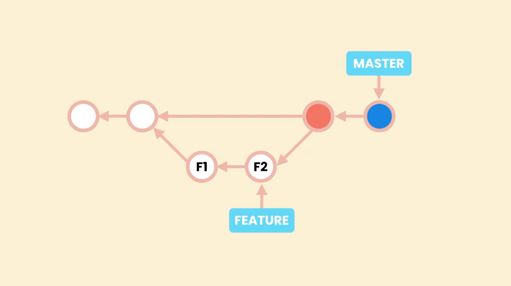
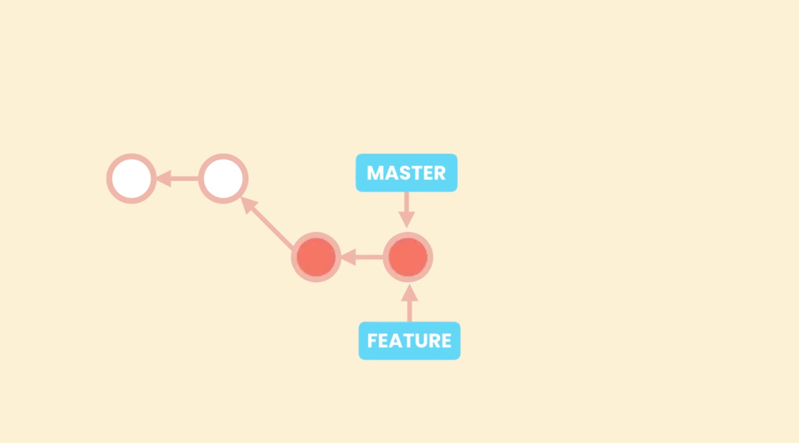

# Fast-forward Merges

Renaming the **bugfix** branch to **fast-forward-merge**.
```shell
~/Git&GitHub (bugfix)
$ git branch -m bugfix fast-forward-merge    #Rename 'bugfix' branch to 'fast-forward-merge'
```

## Git log for branches `--graph`

To have a better visualizations of branches with `git log`, it is better to include the `--graph` option. 

It will produce an output where we are abe to better view the branch path.

```shell
~/Git&GitHub (fast-forward-merge)
$ git log --oneline --graph --all
* 536d022 (HEAD -> fast-forward-merge) Merging Introduction
* bfba2b9 Stashing Complete
* 096c972 Comparing Branches Complete
* 17501ba working with branches Complete
* e3e348f Working with branches
* 537ee9d (master) Branching Introduction
* 907f0e1 (tag: M-03) Module 03 - Browsing History
* d028a00 Finding the Author of Line using Blame Complete
[...]
```

From this we can verify that the branch ***`fast-forward-merge`*** is few commits ahead of ***`master`***, and there is a linear path between them. So they could be merged using the fast-forward method.

## Merge branch fast-forward

`git merge <branch-name>` : To fast-forward merge a branch.

To merge the ***`fast-forward-merge`*** branch into ***`master`***, we first should have committed all of our work in that branch and then we switch to ***`master`***(branch in which the merge will happen). 

```shell
~/Git&GitHub (fast-forward-merge)
$ git switch master
Switched to branch 'master'
```

In the ***`master`*** branch we perform the merge operation:

```shell
~/Git&GitHub (master)
$ git merge fast-forward-merge
Updating 537ee9d..536d022
Fast-forward
 04 Branching/02-Comparing Branches.md |  47 ++++++++++
 04 Branching/03-Stashing.md           | 167 ++++++++++++++++++++++++++++++++++
 04 Branching/04-Merging.md            |  43 +++++++++
 04 Branching/Branching.md             | 146 +++++++++++++++++++++++++++++
 04 Branching/images/Screenshot3.png   | Bin 0 -> 87385 bytes
[...]
```

After the merge operation both **master** and **fast-forward-merge** branch will be pointing to the same commit, which can be verified using `git log`.

```shell
~/Git&GitHub (master)
$ git log --oneline --graph
* 536d022 (HEAD -> master, fast-forward-merge) Merging Introduction
* bfba2b9 Stashing Complete
* 096c972 Comparing Branches Complete
* 17501ba working with branches Complete
* e3e348f Working with branches
* 537ee9d Branching Introduction
* 907f0e1 (tag: M-03) Module 03 - Browsing History
* d028a00 Finding the Author of Line using Blame Complete
[...]
```
## Merge without fast-forward `--no-ff`

`git merge --no-ff <branch-name>` : To enforce a non fast-forward merge with the command 

With this we tell Git that, even though it is possible to have a fast-forward merge, don't do it,  instead create a new commit (merge-commit) to merge the branches.

**Creating a new branch to demostrate no fast forward merge :**
```shell
~/Git&GitHub (master)
$ git switch -C no-fast-forward-merge    #Create a branch at switch to it as well
Switched to a new branch 'no-fast-forward-merge'
```
- Then committing few changes to this new **no-fast-forward-merge** branch

```shell
$ git log --oneline --graph --all
* 2a8c71c (no-fast-forward-merge) No-Fast-forward Merge Introduction
* f6b8810 Refactor '01-Branching.md'
* 0b4befc (HEAD -> master) Fast-forward Merges
* 536d022 (fast-forward-merge) Merging Introduction
* bfba2b9 Stashing Complete
* 096c972 Comparing Branches Complete
* 17501ba working with branches Complete
[...]
```
From this we can verify that the branch ***`no-fast-forward-merge`*** is few commits ahead of ***`master`***, and there is a linear path between them.

To merge the ***`no-fast-forward-merge`*** branch into ***`master`***, we first should have committed all of our work in that branch and then we switch to ***`master`***(branch in which the merge will happen). 

```shell
~/Git&GitHub (no-fast-forward-merge)
$ git switch master    #Switch to master branch
Switched to branch 'master'

```

In the ***`master`*** branch we perform the merge operation with `--no-ff` flag:

```shell
~/Git&GitHub (master)
$ git merge --no-ff no-fast-forward-merge    #Enforce a no fast-forward merge
Merge made by the 'ort' strategy.
 04 Branching/{Branching.md => 01-Branching.md} |  3 +++
 04 Branching/05-Fast-forward Merges.md         | 13 +++++++++++++
 2 files changed, 16 insertions(+)
 rename 04 Branching/{Branching.md => 01-Branching.md} (97%)
```

When we run the `git merge --no-ff no-fast-forward-merge`, our default editor will open, with the default merge commit message (last commit message of the branch which is being merged).<br>
we may/may not modify the default message

After the merge operation both **master** and **no-fast-forward-merge** branch will be pointing to the same commit, which can be verified using `git log`.

```shell
~/Git&GitHub (master)
$ git log --oneline --graph --all
*   edafa2e (HEAD -> master) Merge branch 'no-fast-forward-merge'
|\
| * 2a8c71c (no-fast-forward-merge) No-Fast-forward Merge Introduction
| * f6b8810 Refactor '01-Branching.md'
|/
* 0b4befc Fast-forward Merges
* 536d022 (fast-forward-merge) Merging Introduction
* bfba2b9 Stashing Complete
* 096c972 Comparing Branches Complete
[...]
```

The new branch ***`no-fast-forward-merge`*** was created from commit **`0b4befc`**, then there were two commits on it, and at last it was merged into ***`master`*** in the commit **`edafa2e`** (which was triggered by the merge command with the `--no-ff` option).

## Disable fast-forward merges

It is possible to disable fast-forward merges, that way all mergers Git performs will be non fast-forward, even if it is possible to have a fast forward merge.

1. Disable for a single repository: `git config merge.ff false`
2. Disable globally `git config --global merge.ff false`


## Pros and Cons of Non Fast-Forward Merges:

### Pros:

- Non Fast-Forward Merges are easier to revert. In this case we will be having a **merge commit** that will combine all the changes in the feature branch with the master branch.<br>
We can easily revert this **merge commit**. By reverting the **merge commit** commit, git creates a new commit that undoes the changes of that commit.<br>
Thus in case of Non Fast-Forward merges there is a single commit (merge commit) that needs to be reverted.

- Non Fast-Forward merges results into merge commits, which are the true reflection of the history. A true reflection of what actually happend, when we merged our branches and how they were merged.  
- A Fast Forward merge results into linear history, and a liner history is definitely easy to read, but a linear history is not a true history.

### Cons:

- In contrast when merger happens through Fast Forward merge, the master pointer will also be pointing the feature branch. So, if we want to revert this commit we have more than one commits to undo.
- Since, Fast-Forward merge leads to linear history; we need to revert all commits of feture branch to revert the last commit.
- Some people beleive Fast-Forward merges lead to merge commits which pollutes the history. They make it harder to read and understand whats going on, especially when we have more and more branches. These poeple prefer linear history

