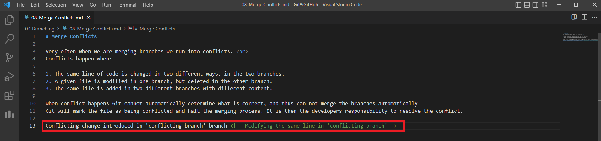
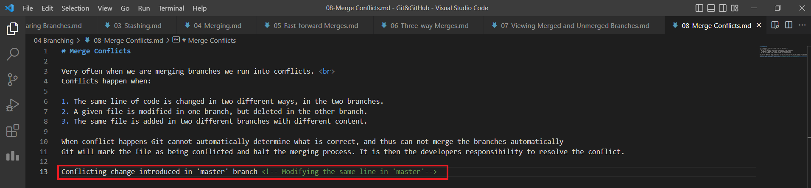
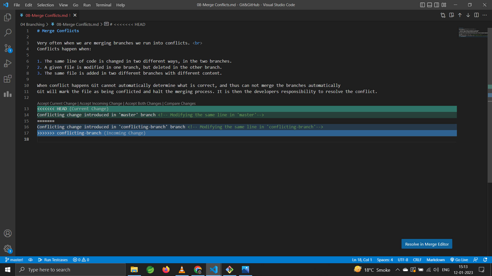
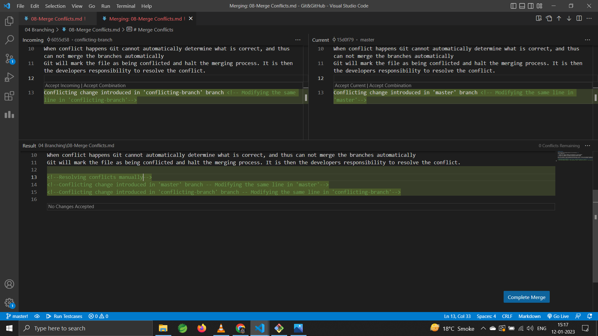

# Merge Conflicts

Very often when we are merging branches we run into conflicts. <br>
Conflicts happen when:

1. The same line of code is changed in two different ways, in the two branches.
2. A given file is modified in one branch, but deleted in the other branch.
3. The same file is added in two different branches with different content.

When conflict happens Git cannot automatically determine what is correct, and thus can not merge the branches automatically.<br>
Git will mark the file as being conflicted and halt the merging process. It is then the developers responsibility to resolve the conflict.

<!--Resolving conflicts manually-->
<!--Conflicting change introduced in 'master' branch -- Modifying the same line in 'master'-->
<!--Conflicting change introduced in 'conflicting-branch' branch -- Modifying the same line in 'conflicting-branch'-->

## Creating a merge conflict

The idea to change same line of a file in both branches

### create branch named ***`conflicting-branch`*** and switch to it.
```shell
~/Git&GitHub (master)
$ git switch -C conflicting-branch    #Create a branch named 'conflicting-branch' and switch to it
Switched to a new branch 'conflicting-branch'
```
### Creating and committing a conflicting changes in the branch ***`conflicting-branch`***
Introducing conflicting changes


Staging and committing the conflicting changes
```shell
~/Git&GitHub (conflicting-branch)
$ git status -s
 M "04 Branching/08-Merge Conflicts.md"

~/Git&GitHub (conflicting-branch)
$ git commit -am "Introduce conflicting change in 'conflicting-branch'"    #Stage and Commit the changes
[conflicting-branch 6055d58] Introduce conflicting change in 'conflicting-branch'
 1 file changed, 2 insertions(+)
```

### Creating and committing a conflicting changes in the branch ***`master`***

#### Switch back to ***`master`*** branch
```shell
~/Git&GitHub (conflicting-branch)
$ git switch master    #Switch to master branch
Switched to branch 'master'
```
#### Introducing conflicting changes


#### Staging and committing the conflicting changes
```shell
~/Git&GitHub (master)
$ git status -s
 M "04 Branching/08-Merge Conflicts.md"

~/Git&GitHub (master)
$ git commit -am "Introduce conflicting change in 'master'"    #Stage and Commit the changes
[master 15d0f79] Introduce conflicting change in 'master'
 1 file changed, 2 insertions(+)

```

Now this file is changed at same line in two different ways across the two branches ***`conflicting-changes`*** branch and ***`master`*** branch.

The branches have diverged and can be verified using `git log`.

```shell
~/Git&GitHub (master)
$ git log --oneline --graph --all -4    #Limit the 'git log' output to last 4 commits
* 15d0f79 (HEAD -> master) Introduce conflicting change in 'master'
| * 6055d58 (conflicting-branch) Introduce conflicting change in 'conflicting-branch'
|/
* 9faf530 Merge Conflicts Introduction
* 3606083 Viewing Merged and Unmerged Branches Complete
[...]
```

### Merging ***`conflicting-branch`*** branch into ***`master`***

```shell
~/Git&GitHub (master)
$ git merge conflicting-branch    #Merge 'conflicting-branch' branch into 'master' branch
Auto-merging 04 Branching/08-Merge Conflicts.md
CONFLICT (content): Merge conflict in 04 Branching/08-Merge Conflicts.md
Automatic merge failed; fix conflicts and then commit the result.
```
- Same file is changed in two different ways across the two branches so, We get merge conflict. Git halts the merge process and now we have to jump in and manually resolve the conflict.

```shell
~/Git&GitHub (master|MERGING)
$ git status    #Git status, shows the conflicting file
On branch master
You have unmerged paths.
  (fix conflicts and run "git commit")
  (use "git merge --abort" to abort the merge)

Unmerged paths:
  (use "git add <file>..." to mark resolution)
        both modified:   04 Branching/08-Merge Conflicts.md

no changes added to commit (use "git add" and/or "git commit -a")
```
- As we can see under `Unmerged paths`, is the file where the conflict is. <br>If we open the file specified here in VS Code, during the merge operation, we will see the conflict

#### Viewing the conflict
```shell
~/Git&GitHub (master|MERGING)
$ code "04 Branching/08-Merge Conflicts.md"    #Opening the conflicting file in vs-code
```


- Herein, we have markers that represent the change in the current branch (***`master`***) as well as the incoming branch (***`conflicting-branch`***).
- The marker **`<<<<<<< HEAD`** represent the start of head branch/master branch (branch in which merge will happen).
- The marker **`=======`** represents end of the head/master branch, and start of the conflicting-branch/incoming branch.
- The marker **`>>>>>>> conflicting-branch`** represents the end of conflicting-branch/incoming branch (branch which will be merged).
- So, the changes between **`<<<<<<< HEAD`** and  **`=======`** represents the changes of master branch. <br>
while the changed between **`=======`** and **`>>>>>>> conflicting-branch`** represents the changes of conflicting-branch branch.

In real sceanarios we have multiple conflicts in the same file. So, for different chunks of conflicting code of same file we will see these markers.

#### Resolving the conflict

Here we can use VS Code options, or edit the file manually to solve the conflict. <br> When solving the conflicts we should avoid at all cost adding new code as it was not present in either of the branches.



>we can run `git status` at this stage to verify that we no longer have unmerged paths which means we no longer have conflicts.

#### Stage and commit the conflict resolution changes (merge-commit)

After finishing resolving the conflict, the file needs to be staged and committed.

```shell
~/Git&GitHub (master|MERGING)
$ git add "04 Branching/08-Merge Conflicts.md"    #Stage the merge-conflict resolution changes

~/Git&GitHub (master|MERGING)
$ git commit    #Merge Commit
[master 73623ad] Merge branch 'conflicting-branch'
```
Because this is a merge commit, we do not need to pass a message, we can accept the default message or may modify it, just run `git commit`

we can verify the merge using `git log`.
```shell
~/Git&GitHub (master)
$ git log --oneline --graph --all -4    #Limit the 'git log' output to last 4 commits
*   73623ad (HEAD -> master) Merge branch 'conflicting-branch'
|\
| * 6055d58 (conflicting-branch) Introduce conflicting change in 'conflicting-branch'
* | 15d0f79 Introduce conflicting change in 'master'
|/
* 9faf530 Merge Conflicts Introduction
[...]
```

[Merge Conflicts Screenshot](./images/Screenshot15.png)

## Aborting a Merge

In case we want to abort a merge that has conflicts we can use the `--abort` option.

```shell
git merge --abort    #To abort a merge
```
Git will take us back to the stage before we started the merge.