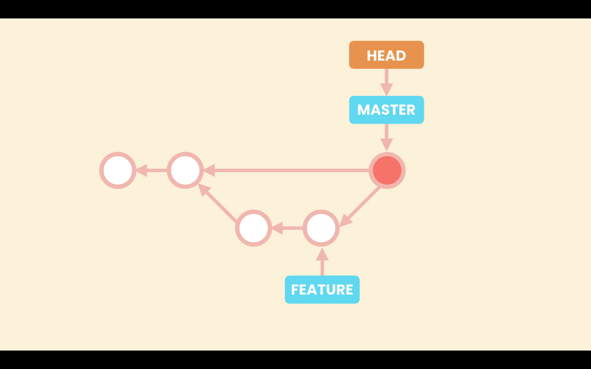

# Undoing a Faulty Merge

In case we need to undo a merge we have two options:

1. Remove the merge commit, as if it was never there  
(This involves re-writing the history so, this should be done oly when the repository is not shared with others)
2. Revert the merge commit

## 1. Remove the last merge commit

This is acheived using the git reset command.

To demonstrate this, we will create a new branch ***`feature`***, add two commits to it and then merging it to the ***`master`*** branch using Non Fast-forward merge (which will result into a merge commit).

Both the ***`master`*** and ***`HEAD`*** pointer will be pointing the last commit which is the merge commit.

The reset command will move both pointers (***`HEAD`*** and ***`master`***) to point the last commit on the master branch before we started the merge. 

Then there won't be any pointers/commit pointing to the merge-commit, So git considers it as a garbage commit; and once in a while git looks for commit like these and removes them from the repository.