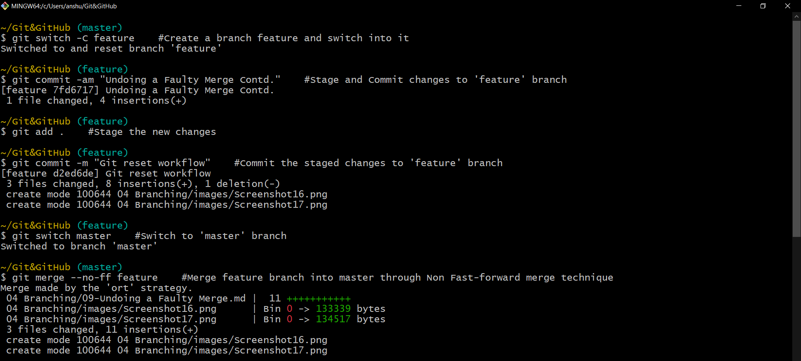
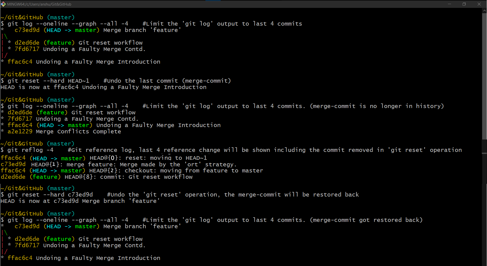
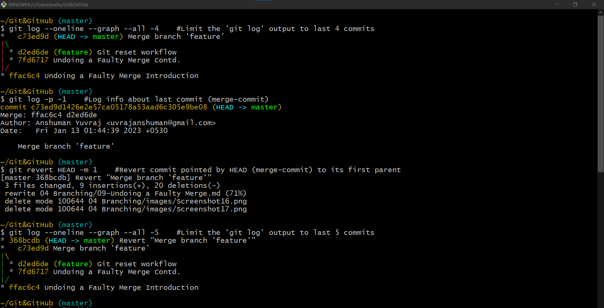

# Undoing a Faulty Merge

In case we need to undo a merge we have two options:

1. Remove the merge commit, as if it was never there <br>
(This involves re-writing the history so, this should be done oly when the repository is not shared with others)
2. Revert the merge commit

## 1. Remove the last merge commit

This is acheived using the git reset command.

To demonstrate this, we will create a new branch ***`feature`***, add two commits to it and then merging it to the ***`master`*** branch using Non Fast-forward merge (which will result into a merge commit).


Both the ***`master`*** and ***`HEAD`*** pointer will be pointing the last commit which is the merge commit.


The reset command will move both pointers (***`HEAD`*** and ***`master`***) to point the last commit on the master branch before we started the merge. 

Then there won't be any pointers/commit pointing to the merge-commit, So git considers it as a garbage commit; and once in a while git looks for commit like these and removes them from the repository.


### Resting the **_`HEAD`_** options

When resting the **_`HEAD`_** pointer, we have three option:

1. soft
2. mixed
3. hard

#### Option `--soft`

```shell
git reset --soft HEAD~1
```

When we reset the **_`HEAD`_** using the `--soft` option, Git will have the **_`HEAD`_** pointer pointing to the indicated commit, in this case `HEAD~1`, so go back one commit, in the **_Repository_**. But the **_Staging Area_** and **_Working Directory_** are not affected.

The pending changes of staging area and working directory remains intact.


#### Option `--mixed`

```shell
git reset HEAD~1
```
In this case Git is going to apply the snapshot of specified commit (`HEAD~1`) to both the **_Repository_** and **_Staging Area_**, local changes in the **_Working Directory_** will not be affected.

The pending changes of staging area will remain intact, while the changes of working directory will be lost.

The `--mixed` is the default option so we do not need to explicitly specify it.

#### Option `--hard`
```shell
>git reset --hard HEAD~1
```
Using the `--hard` option Git will apply the snapshot of specified commit (`HEAD~1) to all environments (**_Working Directory_**, **_Staging Area_**, **_Repository_**).

The pending changes of staging area and working directory will be lost.

### Hard Reseting the merge commit 

- Here in, we will undo the merge-commit and verify it with `git log` (i.e: the merge-commit will be removed from the log)
- And then again will undo the undo of merge-commit (revert `git reset`) and verify it with `git log` (i.e: the merge-commit will show back in the git log)

**Git log specifying the merge-commit and the branches:**
```shell
~/Git&GitHub (master)
$ git log --oneline --graph --all -4    #Limit the 'git log' output to last 4 commits
*   c73ed9d (HEAD -> master) Merge branch 'feature'
|\
| * d2ed6de (feature) Git reset workflow
| * 7fd6717 Undoing a Faulty Merge Contd.
|/
* ffac6c4 Undoing a Faulty Merge Introduction
```

**Hard Resting the HEAD to undo the merge-commit:**
```shell
~/Git&GitHub (master)
$ git reset --hard HEAD~1    #undo the last commit (merge-commit)
HEAD is now at ffac6c4 Undoing a Faulty Merge Introduction
```

**Git log specifying the merge commit is gone:**
```shell
~/Git&GitHub (master)
$ git log --oneline --grah --all -4    #Limit the 'git log' output to last 4 commits
* d2ed6de (feature) Git reset workflow
* 7fd6717 Undoing a Faulty Merge Contd.
* ffac6c4 (HEAD -> master) Undoing a Faulty Merge Introduction
* a2e1229 Merge Conflicts Complete
```

**Git reflog:**
- The view all reference changes. The recently remove merge commit will also be shown.
```shell
~/Git&GitHub (master)
$ git reflog -4    #Git reference log, last 4 reference change will be shown including the commit removed in `git reset` operation
* ffac6c4 (HEAD -> master) HEAD@{0}: reset: moving to HEAD~1
* c73ed9d HEAD@{1}: merge feature: Merge made by the 'ort' strategy.
* ffac6c4 (HEAD -> master) HEAD@{2}: checkout: moving from feature to master
* d2ed6de (feature) HEAD@{3}: commit: Git reset workflow
```

**Undoing the git reset operation:**

As evident from git reflog `c73ed9d` was the merge-commit.

```shell
~/Git&GitHub (master)
$ git reset --hard c73ed9d    #Undo the 'git reset' operation, the merge-commit will be restored back
HEAD is not at c73ed9d Merge branch 'feature'
```



## 2. Revert the merge commit

**Git log specifying the merge-commit and the branches:**
```shell
~/Git&GitHub (master)
$ git log --oneline --graph --all -4    #Limit the 'git log' output to last 4 commits
*   c73ed9d (HEAD -> master) Merge branch 'feature'
|\
| * d2ed6de (feature) Git reset workflow
| * 7fd6717 Undoing a Faulty Merge Contd.
|/
* ffac6c4 Undoing a Faulty Merge Introduction
```
**Info about last commit:**
```shell
~/Git&GitHub (master)
$ git log -p -1    #Log info about last commit (merge-commit)
commit c73ed9d1426e2e57ca05178a53aad6c305e9be08 (HEAD -> master)
Merge: ffac6c4 d2ed6de
Author: Anshuman Yuvraj <uvrajanshuman@gmail.com>
Date:   Fri Jan 13 01:44:39 2023 +0530

    Merge branch 'feature'
```
- As evident from output, the merge-commit has two parent commit `ffac6c4` and commit `d2ed6de`.

**Reverting the merge-commit:**
```shell
~/Git&GitHub (master)
$ git revert HEAD -m 1    #Revert commit pointed by HEAD (merge-commit) to its first parent
[master 368bcdb] Revert "Merge branch 'feature'"
[...]
```
- While reverting the merge commit, the parent with which it needs to be compared should be specified. The parent may be specified with the `-m` flag in git revert followed by the parent-number.<br>
The parent number is assigned from left. 1: left parent 2: right parent

**Git revert output:**

```shell
~/Git&GitHub (master)
$ git log --oneline --graph --all -5    #Limit the 'git log' output to last 5 commits
* 368bcdb (HEAD -> master) Revert "Merge branch 'feature'"
*   c73ed9d Merge branch 'feature'
|\
| * d2ed6de (feature) Git reset workflow
| * 7fd6717 Undoing a Faulty Merge Contd.
|/
* ffac6c4 Undoing a Faulty Merge Introduction
```
- As evident from output `git revert` creates new commit `368bcdb` reverting the changes of merge-commit `c73ed9d`.<br>
The reverted commit will match the commit `ffac6c4`.

- This will revert all the changes made by the second branch (feature) on master. The resulting tree will behave as the branch feature was never merged to master.




## Summary:
- The `git revert` is a **safe** way to undo changes as it does not alters the history, while `git reset` can be considered as the dangerous method. 
- There is a real risk of losing work with git reset. Git reset will never delete a commit, however, commits can become 'orphaned' which means there is no direct path from a ref to access them. <br> These orphaned commits can usually be found and restored using git reflog. Git will permanently delete any orphaned commits after it runs the internal garbage collector. By default, Git is configured to run the garbage collector every 30 days.
- Resetting completely removes a changeset, whereas Reverting maintains the original changeset and uses a new commit to apply the undo