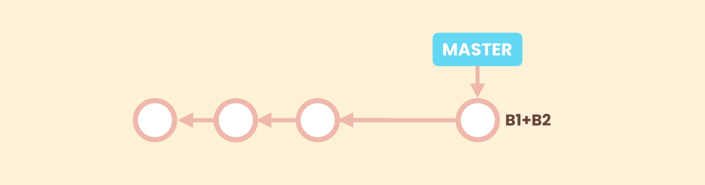

# Squash Merging

Let us consider we have a bugfix branch with two commits b1 and b2. 
Normally when we are done making changes in bugfix branch we merge them into master
This will lead to a merge-commit in master which will have two parents **_master_** and **_bugfix_**. 
After merge the commits b1 and b2 will become part of the history of the **_master_** branch.

But what if these commits b1 and b2 are not good quality commits. And we don't care about the history of the **_bugfix_** branch. 

In such cases **Squash Merging** should be used. 

## Squash Merge

In Sqush Merge all the changes/commits of a branch (that is to be merged) get combined into a single commit, and this combined commit get applied on top of the branch in which merge is going to happen.

So, here a new commit will combine all the changes of the bugfix branch (i.e: b1+b2). we will be having a single logical changeset representing all the changes for bugfix. 
Then this combined commit will be applied on top of the master branch. 

- This is useful in situations where the commits in the branch are not good quality commits, or simply we do not need the history from the coming branch.

This new commit is not a merge commit, because it does not have two parents. It is lacking the reference to **B2**, the last commit from the **bugfix** branch.  
It is just a regular commit added on top of ***`master`*** that combines the commits from the other branch.

when we are done with squash merging and delete the **bugfix** branch, we are left with a clean linear history. This is the benefit fo Squash merging. 

> But usually we should only use squash merging for short lived branches with bad history.

 `git merge --squash <name-of-branch>` : To perform a squash merge.
 
Git will create a new commit, called a ***`Squash commit`***, that combines the changes made in the merged branch, and it will apply these changes to the ***Staging Area***. Then these staged changes can be committed normally.

>The squash merge changes gets applied to staging area and needs to be committed manaually.

[Creating bugfix branch with two commits](./images/Screenshot24.png)

Squash merge combined both the commits of bugfix branch (`9d83403` and `8823111`) into a single commit (`ee008c8`) and applied it on top of master branch.

## List merged and unmerged branches

If we run `git branch --merged`, to list all the merged branches we will not see the **bugfix** branch. Technically we don't have a merge commit. so when doing a squash merge it is super important to remove the merged branch else it will staty there (as unmerged branch) and may create confusion later on. 

In this situation we have to use `-D` instead of `-d` to delete the `bugfix` branch, or Git will throw an error as `bugfix` is treated as unmerged branch.  
So `git branch -D bugfix`.

## Conflict in Squash merge

In case we run into conflicts when running a Squash merge, we can resolve this conflicts in similar way as conflict in a normal merge.
