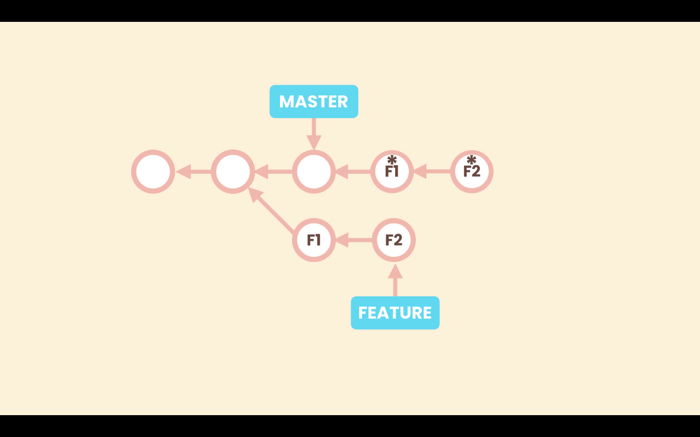

# Rebasing

In case of diverged branches, on merging we will end up in a non-linear history. <br>
As we have more and more branches this technique might make the history less readable.

Here, rebasing can be used instead of normal merge to make the history linear.

Suppose we have **_`master`_** and a new branch **_`feature`_**, that have diverged. With the rebase technique we can change the base of the **_`feature`_** branch, to the latest commit on **_`master`_**. <br>
This will result in a linear history.


After rebasing, the base commit of **`feature`** will be the latest commit of **_`master`_**.

```shell
>git rebase master
```


When we merge **_`feature`_** into **_`master`_**, it is a fast-forward merge that will update the **_`master`_** pointer to point the lastest commit of the **_`feature`_** branch, resulting into a linear history.


>In Git, the term rebase is referred to as the process of moving or combining a sequence of commits to a new base commit. 

>We should be cautious with rebasing because it re-writes the history. 
So, we should only apply it on local branches, if we have not shared our history with other collaborators.

## How does Rebase merge work

Git commits are immutable, so what actually happens with rebasing, is that Git creates new commits (**F1\*** and **F2\***) that looks like the commits of the incoming branch **_`feature`_**, and applies them in top of **_`master`_**.



Then Git moves the pointer of **feature** to point the latest commit of these newly created commits (**F1\***, **F2\***). The original commit **F2** is no longer referenced by any commit or branch, so the commits **F1** and **F2**, will be considered garbage commit and will be eventually removed.

So we are re-writing history. **F1\*** and **F2\*** are not the same commit as **F1** and **F2**. And if we have shared **F1** and **F2** publically and other devs have created new commits on top of **F2**, now after rebasing their history will get screwed.

