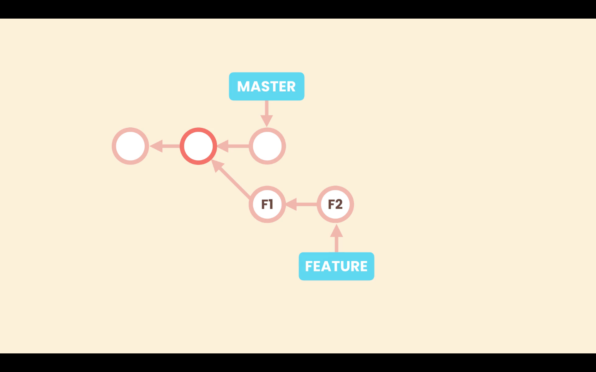
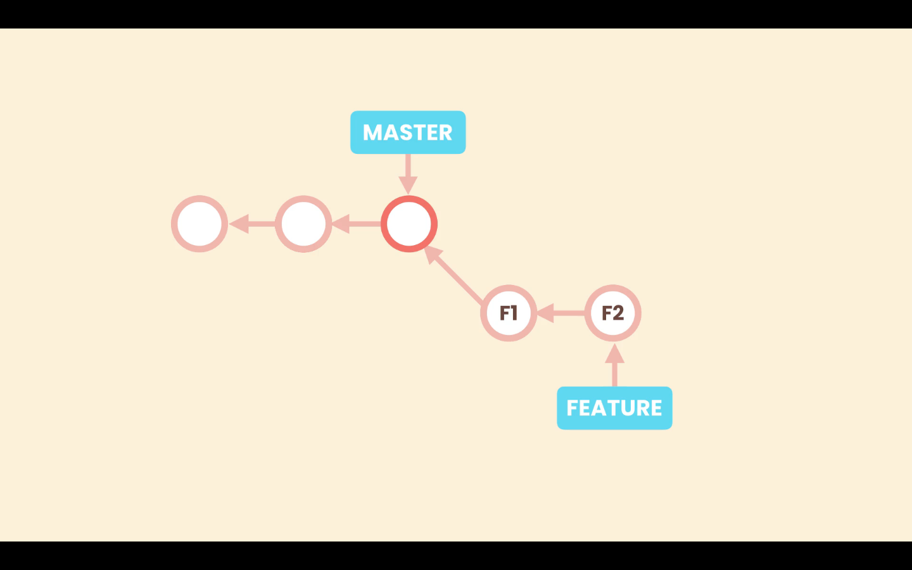
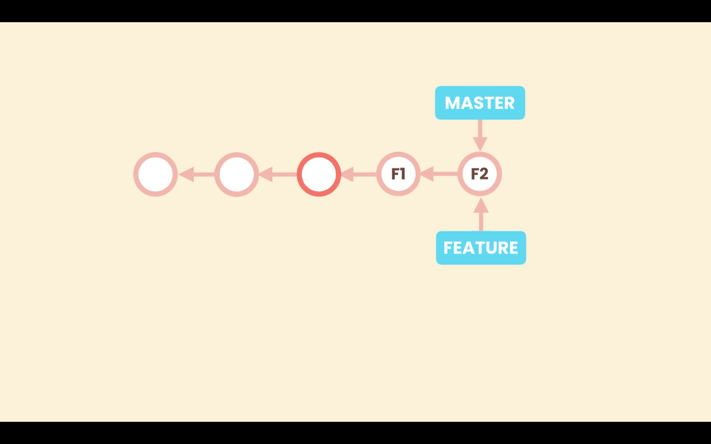

# Rebasing

In case of diverged branches, on merging we will end up in a non-linear history. <br>
As we have more and more branches this technique might make the history less readable.

Here, rebasing can be used instead of normal merge to make the history linear.

Suppose we have **_`master`_** and a new branch **_`feature`_**, that have diverged. With the rebase technique we can change the base of the **_`feature`_** branch, to the latest commit on **_`master`_**. <br>
This will result in a linear history.



After rebasing, the base commit of **`feature`** will be the latest commit of **_`master`_**.

```shell
>git rebase master
```



When we merge **_`feature`_** into **_`master`_**, it is a fast-forward merge that will update the **_`master`_** pointer to point the lastest commit of the **_`feature`_** branch, resulting into a linear history.



>In Git, the term rebase is referred to as the process of moving or combining a sequence of commits to a new base commit. 

>We should be cautious with rebasing because it re-writes the history. 
So, we should only apply it on local branches, if we have not shared our history with other collaborators.

## How does Rebase merge work

Git commits are immutable, so what actually happens with rebasing, is that Git creates new commits (**F1\*** and **F2\***) that looks like the commits of the incoming branch **_`feature`_**, and applies them in top of **_`master`_**.


Then Git moves the pointer of **feature** to point the latest commit of these newly created commits (**F1\***, **F2\***). The original commit **F2** is no longer referenced by any commit or branch, so the commits **F1** and **F2**, will be considered garbage commit and will be eventually removed.

So we are re-writing history. **F1\*** and **F2\*** are not the same commit as **F1** and **F2**. And if we have shared **F1** and **F2** publically and other devs have created new commits on top of **F2**, now after rebasing their history will get screwed.


>To demonstrate `git rebase` we will create a new branch **_`rebase-branch`_**, add two commits to it (one of these commits will be a dummy commit meant to be skipped while rebasing) then switch back to master to create a conflicting commit.<br> The branches will diverge and can be verified using `git log`.

[Changes for demonstrating `git rebase`](./images/Screenshot32.png)

## Rebase command

`git rebase <branch-name>` : To rebase current branch to the specified branch.

First in the new branch in this case **rebase-branch** run `git rebase master`.

Then we switch to **_`master`_** and run `git merge <name-of-branch>`.


## Resolving conficts

### Rebase `--continue`

Rebasing may lead into conflicts.

Resolving conflicts is similar as in other situations. When we run `git rebase master`, we will be warned of conflicts if there exists any. After resolving this conflicts we run:

```shell
git rebase --continue
```

This will make Git apply the next commit of **_`rebase-branch`_** on top of **_`master`_**. It is possible that, the next commit also has conflicts , so we must resolve it once more.

### Rebase `--skip`

Alternatively, while applying commits through rebase we can use the `--skip` option to skip the current commit and move to the next commit. For example if the conflict appear in a particular commit, but we do not care about that commit we can skip it and move onto the next one.

```shell
git rebase --skip
```

### Rebase `--abort`

We can abort the rebase operation with the option `--abort`. For example if we have too many conflict and do not want to go through a complete rebase. Aborting the rebase will take us back to the previous state before starting rebasing.

```zsh
git rebase --abort
```

## Rebase command

`git rebase <branch-name>` : To rebase current branch to the specified branch.

First in the new branch in this case **rebase-branch** run `git rebase master`.

Then we switch to **_`master`_** and run `git merge <name-of-branch>`.


## Resolving conficts

### Rebase `--continue`

Rebasing may lead into conflicts.

Resolving conflicts is similar as in other situations. When we run `git rebase master`, we will be warned of conflicts if there exists any. After resolving this conflicts we run:

```shell
git rebase --continue
```

This will make Git apply the next commit of **_`rebase-branch`_** on top of **_`master`_**. It is possible that, the next commit also has conflicts , so we must resolve it once more.

### Rebase `--skip`

Alternatively, while applying commits through rebase we can use the `--skip` option to skip the current commit and move to the next commit. For example if the conflict appear in a particular commit, but we do not care about that commit we can skip it and move onto the next one.

```shell
git rebase --skip
```

### Rebase `--abort`

We can abort the rebase operation with the option `--abort`. For example if we have too many conflict and do not want to go through a complete rebase. Aborting the rebase will take us back to the previous state before starting rebasing.

```zsh
git rebase --abort
```
