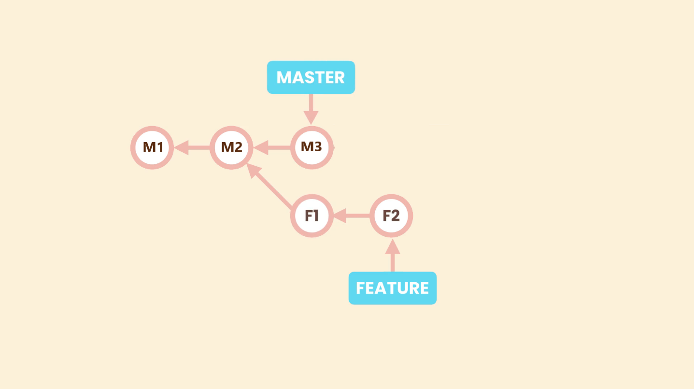
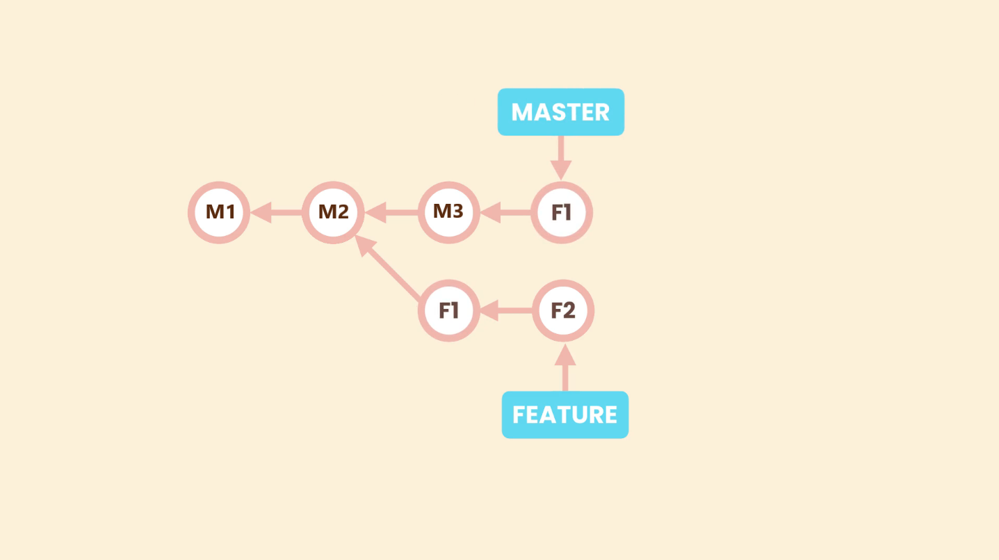

# Cherry Picking

Git cherry picking enables arbitrary Git commits to be picked by reference and appended to the current working HEAD. 

Cherry picking is the act of picking a commit from a branch and applying it to another. `git cherry-pick` can be useful for undoing changes. <br>
For example, say a commit is accidently made to the wrong branch. You can switch to the correct branch and cherry-pick the commit to where it should belong.

Let us assume we have a repository with the following branch state:


Lets say we need one of the commits (F1) from **_`feature`_** branch in **_`master`_** branch. Just one commit, not a full merge.

To achieve this we use cherry picking.

First we must be in the **_`master`_**, and then there we run `git cherry-pick <commit-ID>`

This will result in addition of F1 commit chages to master branch which needs to be committed manually. This may result in conflicts which would need resolution.

Then we must make a commit. We do not need to specify a message, wen we run `git commit`, the default editor will open with a default message based in the commit we are cherry picking, we can accept it or change it.



```shell
>git cherry-pick 5670ecc    #Cherry-pick F1 commit using commit-id.

>git commit    #Commit the staged changes.
```
