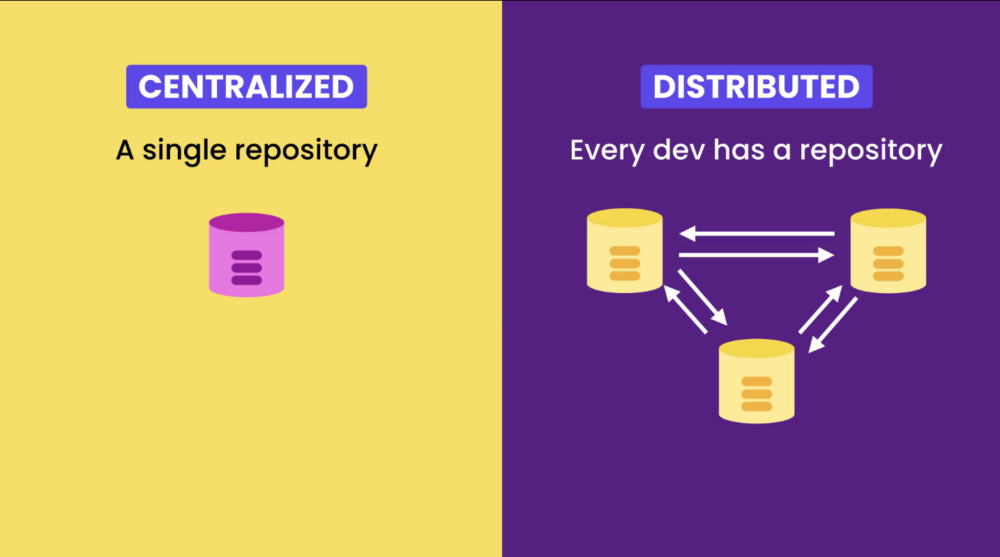
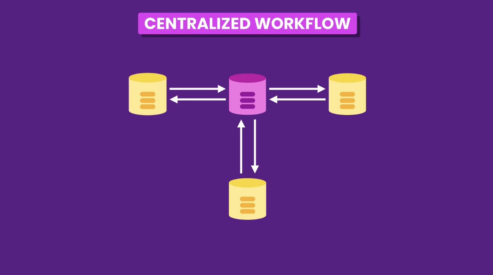
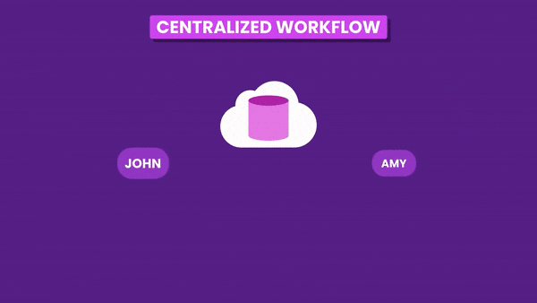
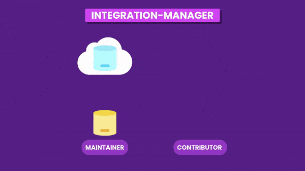

# Workflows

Version Control Systems falls into two categories :
1. Centralized
2. Distributed

**Centralized Version Control System:**
In Centralized Version Control Systems like Subversion, we have a single central repository that is shared by all the collaborators.
Everyone being dependent on this central repository leads to a single point of failure. i.e: if the central server goes offline no one will be able to commit or view the history.

**Distributed Version Control System:**
While in Distributed Version Control Systems like Git, every collaborator has their own complete copy of the central repository.
They are not dependent on the central server, and can work offline with their local repository. 

How can we collaborate with this model?  
we can synchronize our work directly with each other. But this is often too complex and error prone. 
With a distributed VCS like Git it would be possible for each developer to synchronize his work with each member of the team.

But, usually, this is not the best solution, it's too complex and more susceptible to errors. Instead it is better to use, what is called, a **Centralized Workflow**. 
Each developer still keeps a full local copy of the repository, but instead of syncing with each other they sync with a **Remote Repository** (central repository).

With this model we don't have a single point of failure. If the **Remote Repository** fails we still can sync the repository with each other.

## Centralized Workflow

Let say John and Amy are the two collaborators of the project.

The collaborating workflow usually follows following steps: 

1. ### Clone the Remote Repository
    - First team members clone the repository from the **Remote Repository**. By cloning, thy will have a full copy of the repository on their machine (**Local Repository**).
    - So, John and Amy clone the central repository/remote repository.

2. ### Push to Remote Repository
    - Team members start working and commit to their **Local Repository**. At any time they can use the **`push`** command to sync (upload) their work to the **Remote Repository**, so that it is shared with other collaborators.
    - So, lets say John works and makes a few commits. (Amy could also be making commits in the meantime, but lets kepp it out of consideration for simplicity.) 
    John pushes his changes/code to the central repository. So the central repository is now in sync with John's work.

3. ### Pull from Remote Repository
    - Any other team member can use the **`pull`** command to bring (download) new changes of **Remo Repository** to their **Local Repository**.
    - So, Amy pulls the new changes using pull command to bring Johns work into her local repo. 
    If john's work conflicts with Amy's work, Amy has to resolve those conflicts and push her changes to the central repository.

>This is the centralized workflow used in most teams, where everyone has push acess to write to the repo.

## Integration-Manager workflow (Workflow for open-source projects)

In this case we have one or more **maintainers** and many **contributors**.
The problem is we do not know the contributors so, can not trust them and provide them push/write access to the repository; only the maintainers have the push/write access to the official **Remote Repository**.

1. In a open-source project, usually only the maintainers have push access to the original **Remote Repository**.  
Other developers that want to contribute to the project first have to **fork** the **Remote Repository**, in order to have a copy of it in their cloud storage like GitHub.

2. Afterwards a contributor can clone this **forked repository** to get a local copy on their machine and start working.

3. The contributor can make few commits and when he is ready to share his work; can **`push`**  to send the changes to the forked **Remote Repository**

4. Next the contributor sends a **Pull Request** to the maintainers of the project (this is a feature built-in most of the platforms like GitHub).

5. The maintainer of the project gets notified of **Pull Request**.  
The maintainer can **`pull`** in the changes from the **forked repository** of contributor to their local machine, review them and if agrees with proposed changes they can merge the contributed work (proposed changes) into their local repository.

6. Then the contributer **`push`** the merged changes to the original **Remote Repository**.

This is called Integration manager workflow because some one is incharge of integrating the changes.  
A contributor can not push directly to the official repository. The contributor needs to fork it. And since the forked repo is in cloud so the maintainer can also view and pull it.
