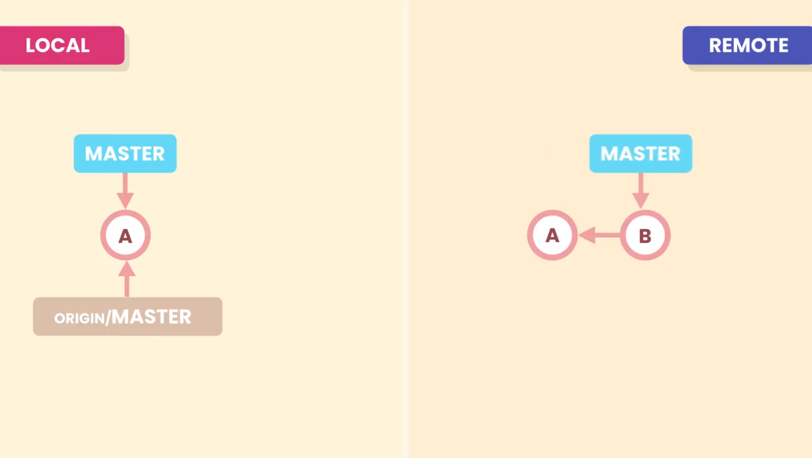

# Fetching

The **Local Repository** is not connected/sync to the remote repository

Let's consider this situation on the left side where we have our local repository and on the right side we have our remote repository.

The **Local Repository** and **Remote Repository** work independently.<br> 
If we have new commits (in this case **B**) in our **Remote Repository**, because any another collaborator pushed their work, our **Local Repository** will not be aware of it.



We have to use the `git fetch <remote-repository>` command to download the new commits of **Remote Repository**. When we do so the **_`origin/master`_** pointer (remote tracking branch) will move forward, to point the latest commit fetched from the **Remote Repository**. <br>
But our working directory will not be updated as master will still be
pointing to **A**.

```shell
>git fetch origin
```


Optionally we can specify a branch to the `fetch` command, like `git fetch <remote-repository> <branch-name>` to download commits of that specified branch only.

Ex:
```shell
>git fetch origin bugfix
```

>`origin` is the default option for remote-repository and `master/main` is the default option for remote-branch, so no need to specify them explicitly.<br>
>So `git fetch` is equivalent to `git fetch origin master/main`

To update our branch with the changes downloaded from the `fetch` command, we have to merge them with our branch, with the command:

```shell
>git merge origin/master
```

Since our branches have not diverged,there will be fast forward merge.
In contrast if our branches would have direverged then there would be 3-way merge and if we had conflicts we would need to resolve those for merging .

The master pointer will now point to the latest fetched commit from remote repository.

## Remote and Local branches

With the command `git branch -vv` we can se how the remote and local branches are diverging.

```shell
>git branch -vv
* main bbe3812 [origin/main: ahead 2] add details to lesson
```

In the above output from the `git branch -vv` we can see that our local **_`main`_** branch is connect to the remote **_`origin/main`_** branch. And the local branch is ahead by 2 commits.

## Summary


- `git fetch` will download the latest commit from the remote repository and will move `origin/master` pointer to point the latest fetched commit on remote branch.
- `git merge` will merge the latest changes fetched into the `master` branch.

