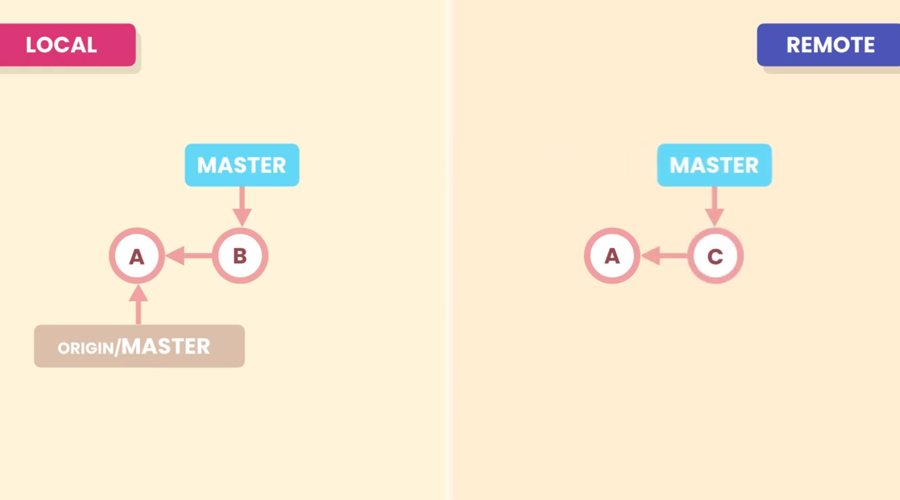
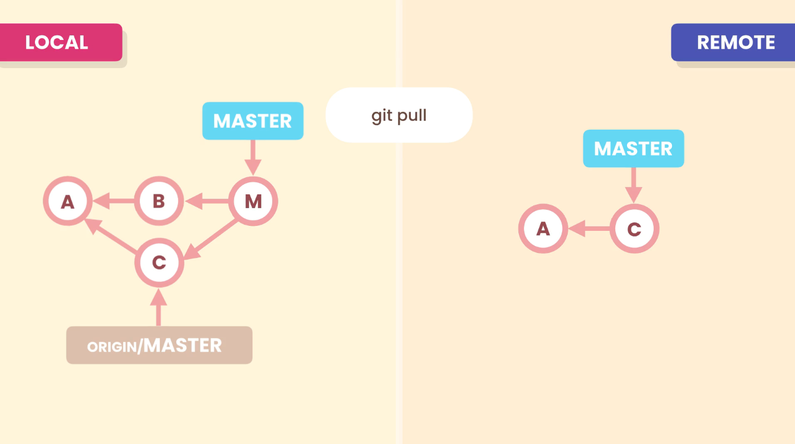

# Pulling

So, to bring the changes of a remote repositoy into local repository most of the time we have to fetch followed by a merge.

Let's say our **Local Repository** and **Remote Repository** has evolved differently.  
The Local repositoy has most recent commit **B** while the Remote repository has most recent commit **C** (which is not present in Local repository).

## `git pull`
The `pull` command combines the `fetch` and `merge` together. With this command Git will download the latest commits from the **Remote Repository** branch and merge them with the latest commit of **Local Repository** branch. 
By default Git will perform a **fast-forward merge** if possible, if it is not possible (like in case of diverged branches), git will perform a **3-way merge**.
And if conflict arises while merging we need to reslove them as well.

So here, `git pull` will download the commit **C**. 
Now since, our branches have diverged. In this case git will perform a three way merge **M** to merge the remote changes into our master branch.

>But if someone doesn't likes the merge-commits as it pollutes the history, they can use the rebase option as well for linear history.

## `git pull --rebase`

With the command `git pull --rebase` Git will rebase the latest changes of **Local Repository** branch on top of the latest changes of **Remote Repository** branch.

So, instead of `git pull`, if `git pull --rebase` is used Git will rebase our master branch and change the base of master from commit **B** to commit **C**.  
This will lead to a simple linear history.

# Summary

- `git pull` will fetch the latest changes from remote repository and merge them with the local repository.
- `git pull --rebase` will fetch the lates changes from the remote repository and will rebase the local branch changes on the fetched changes of remote repository.
