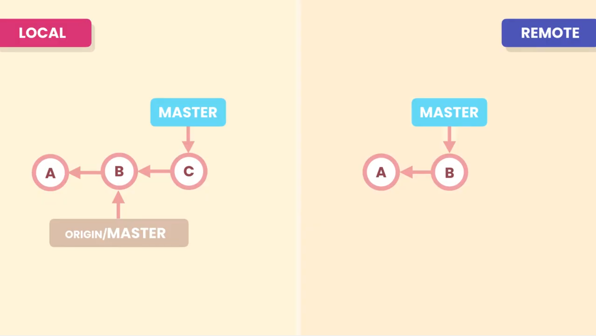
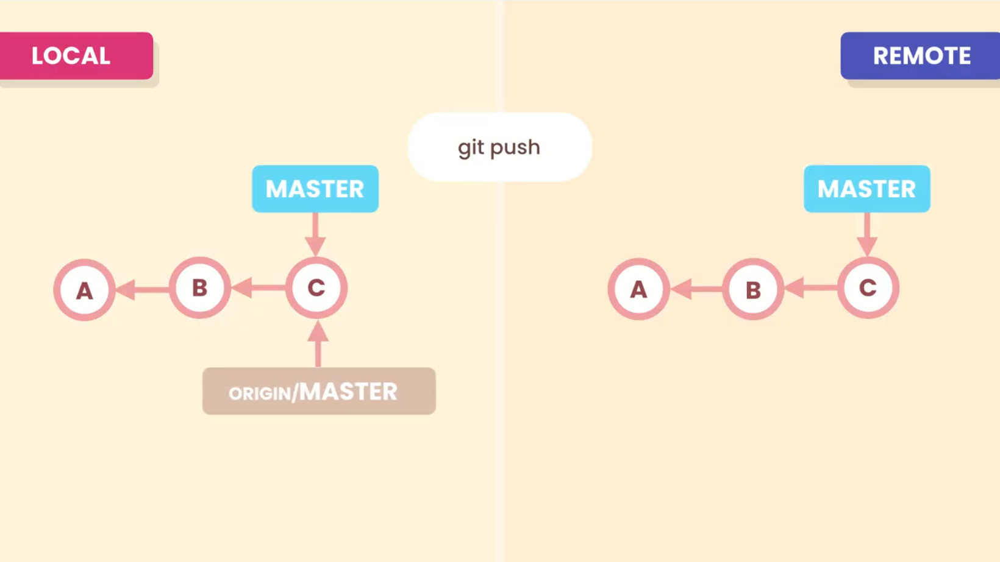
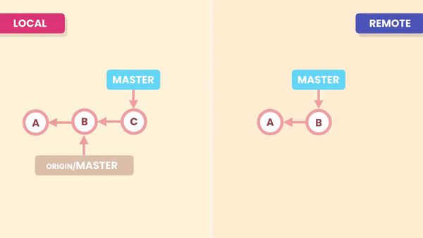

# 08- Pushing

With the `git push <remote-repository> <name-of-branch>` command we can send (upload) our **Local Repository** changes to the **Remote Repository**.

Let's consider a case in our local repository our master branch is ahead of remote tracking branch (**origin/master**) by one commit (i.e: we have one new commit **C** in local repository which is yet to be sent/uploaded to the remote repository).



`git push` can be used to send this new commit **C** to remote repository branch.<br>
Git will then move the **master**/**main** pointer of remote repository to point to this latest commit uploaded there (i.e: **C**).<br>
And finally Git will move remote tracking branch pointer (**origin/master**) in local repository to point to **C** as well
```shell
>git push origin master
```


It is also possible to abbreviate this command and only run `git push`, by default Git assumes the **Remote Repository** **_`origin`_**, and it will also assume the current branch.

## Reject push

In some situations our `push` may be rejected. For example if some team member pushed before us. So the **Remote Repository** and **Local Repository** histories have diverged.

To resolve this, first we have to `pull` the **Remote Repository** changes and merge those changes, and them we can `push`.


>`git push -f` is  way to force push our commit to the remote repository. It will drop the last commit in the repo with our new commit. It is a terrible thing to do. Instead we should pull, merege changes and then push. as -f will delete others collaborator's work.<br>
>Unless you have a very strong reason you should never ever use this option.

## Summary



- `git push` can be used to push the latest changes to the remote repository.