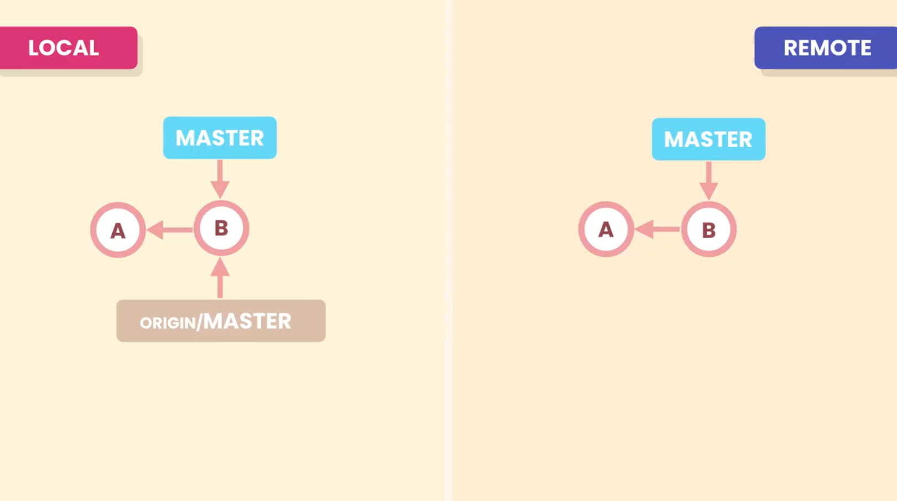
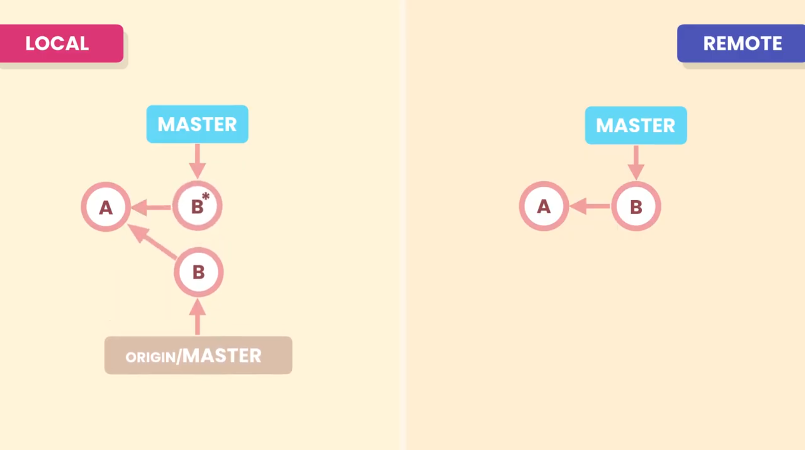
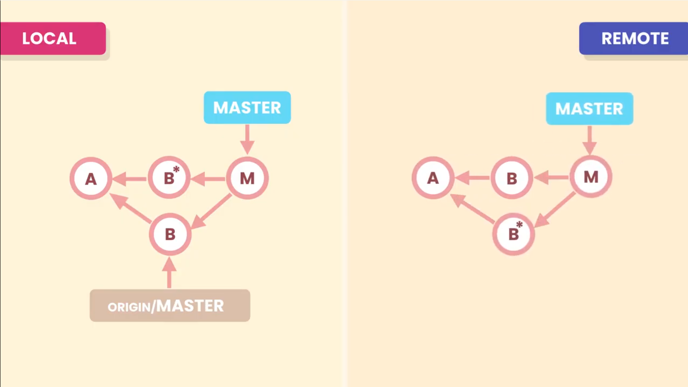
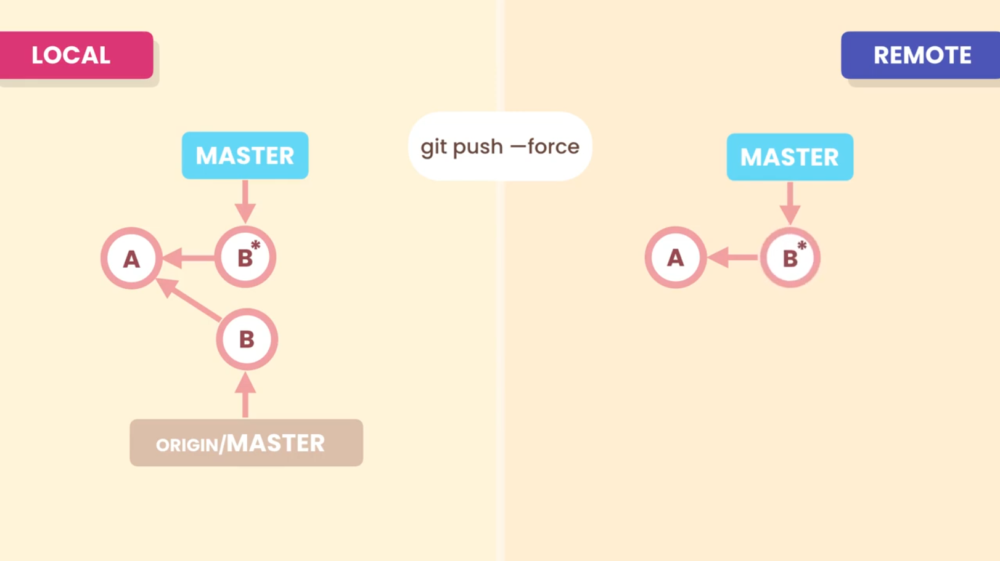
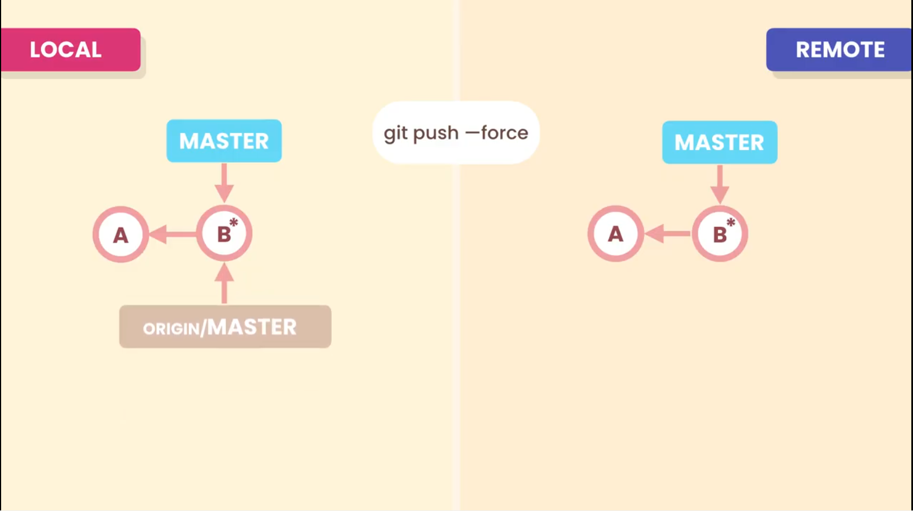
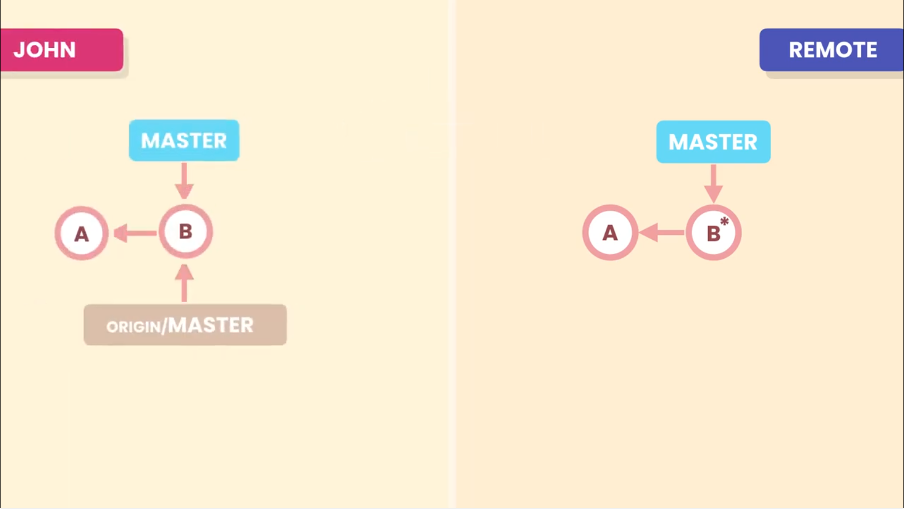
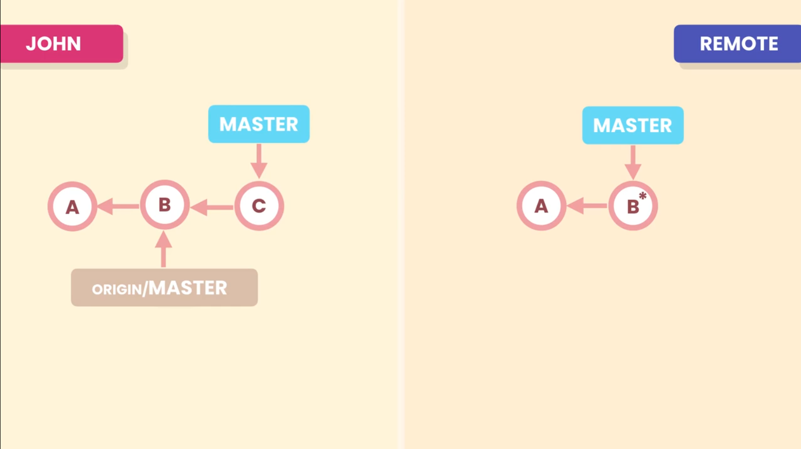
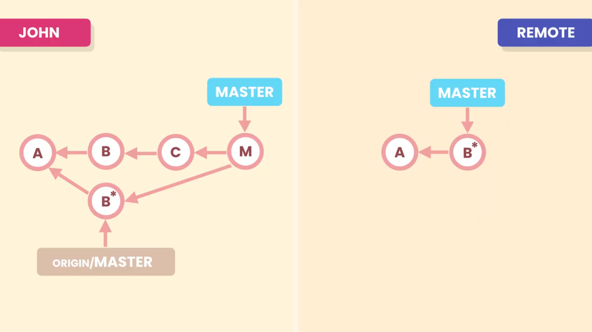

# Rewriting History

## Why do we even need the history?

With Git history we can see:
- What was changed
- Why it was changed
- When it was changed
- Track progress of the project

## Bad commits

Bad commits make it difficult to read the project history.

Bad commits refer to following:
- Poor commits messages, with no meaning
- Too large commits, with unrelated changes
- Too small commits, scattered all over the history
- Unwanted or accidental commits
- Wrong ordering of commits

In such cases we will not be able to extract meaningful information from the history.

We need a clean readable history to be able to see how our project evolved from day one.

## Tools

To make our history cleaner we can use several Git operations.
- Squash small, related commits into a single commit that represents a logical changeset.
- Slipt large commits with unrelated changes into bunch of related smaller commits each representing a logical changeset.
- Reword poor commits messages
- Drop unwanted commits/accidental commits
- Modify the content of a commit

## Rule for Re-Writing the History

**Don't re-write the public history** 
The commits that have been pushed to a public repository, and shared with other developers should not be modified.

Consider our local and remote repository are in the same state (they have the same history) 

Now if modify the commit **B** in our local repo. Since, commits in Git are immutable. So,modifying **B** will result in a new commit **B\***

But, Git is going to reject the push as the master branch has diverged and there are some changes in **origin/master** that are not present in local master branch.

So in this case we need to merge **origin/master** into local **master** then we can push the master branch. Now our local and remote repo have the same history.

But,we have created non linear and noisy history. These two commits **B\*** and **M** (merge commit) are unnesseary. we wanted to modify **B** and replace it with something better so why should we keep it in history. 

**An alternative solution:**

we can use **_force_** option to force git to override what is in origin with what we have locally. 

So git will drop **B** and replace it with **B\*** in the remote repo.
And, then it is going to attach **origin/master** to **B\*** in our local repo.

In this way we end up with simple and linear history.

Imagine this is john's repo before we did the forced push.

John is not aware of our forced push commit **B\***. In his repo he only has the commits A and B. So lets consider he add a new commit C and then tries to push.

John push is going to be rejected as his **local master branch** is diverged from **origin/master** (remote repo). There are some changes in origin (**B\***) which are not present in the local repo.

So first he has to do a pull to bring in **B\*** and then merge it with local master resulting in merge commit **M**. 
Now he can push.
But once again our history became non-linear and noisy

**So, never rewrite public history.**