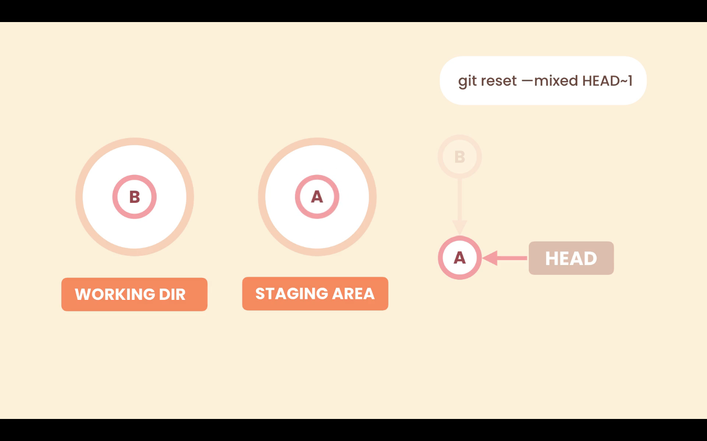

# Undoing Commits

There are two ways to undo a commit
1. Revert commit -> The commit has been pushed to a public **Remote Repository** : <br>
    If the commit has been pushed to the remote repository, chances are other collaborators may have based their work on top of this commit. 
    In such cases the `revert` command should be used to create a new commit that will undo all the change of this commit.
2. Reset commit -> The commit has not been pushed to a public **Remote Repository** : <br>
    But, if the commit has not been pushed to the remote repository, thus exists only in the local repository. 
    `reset` command can be used in such cases to entirely remove this commit from the history.

# Git Reset

- Git Reset is the command used to move the repository back to a previous commit, discarding any changes made after that commit.
- It allows you to go back to a previous commit, removing any other commits on its way back.
- The target commit can be provided to the `reset` command using the `HEAD~n` syntax or directly specifying the commit Id. And git will move our repository to that commit removing all the commit that come in between from the history. (as if they were never there)

```shell
git reset <option> <commit-sha>  
```

The `git reset` command supports three options : 
1. Soft : Removes the commit only
2. Mixed : Removes the commit as well as unstages them.
3. Hard : Removes the commit as well as unstages them and discards local changes as well

The default invocation of git reset has an implicit arguments of `--mixed` for options and `HEAD` for commit-reference.

This means executing only `git reset` is equivalent to executing `git reset --mixed HEAD`.<br> 
In this form `HEAD` is the specified commit. Instead of `HEAD` any `Git SHA-1` commit hash can be used.

Consider we have two commits in our **Local Repository** `A` and `B`, `B` being the last commit `HEAD` is pointing to it. In the **Staging Area** and **Working Directory** we have the same code as in the last snapshot (**Local Repository**).


### Option --soft


The `--soft` option only changes the **Local Repository**. Removes the commit only.

If we use `git reset --soft HEAD~1`, Git will point `HEAD` to the target location, in the **Local Repository**, but it is not going to touch the **Staging Area** and **Working Directory**.

This is the same state as before we committed `B`. We have some changes (same as commit B) in the **Staging Area** and **Working Directory**, that have not yet been committed.

### Option --mixed



The `--mixed` option will change the **Local Repository** and the **Staging Area**. We go one step back, it will unstage the changes.

With the `--mixed` option Git will move the `HEAD` pointer, from `A` to `B` as in the `--soft` option, and will put the target snapshot (`A`) in the **Staging Area** as well, but it will not touch the **Working Directory**.
The working directory will still be same cahnges as the commit `B`.

This is the same state as before we staged our changes. We have some changes in the **Working Directory**, that have not yet been staged.

### Option --hard


The `--hard` option will change the **Local Repository**, **Staging Area**, and the **Working Directory**. Even one more step back, discards local changes as well.

With the `--hard` option Git will move the `HEAD` pointer from `A` to `B` and put the last snapshot in the **Staging Area** as in the `--mixed` option, and will put the target snapshot (`A`) in the **Working Directory** as well. So the new changes in the **Working Directory** are gone.

The would be the same state as if the changes of commit `B` never happended even in working directory.

## Undoing the last ambiguious commit
```shell
~/BadHistory (master)
$ git log --oneline
b305d5a (HEAD -> master) .
92ade19 WIP
357f15f Update terms of service and Google Map SDK version.
42f2f93 WIP
de106c9 Add a reference to Google Map SDK.
15bf387 Change the color of restaurant icons.
fdf3781 Fix a typo.
7b90516 Render restaurants the map.
de1b321 Initial commit
```

Consider the last commit is useless and we want to undo it using the `git reset`.<br>
Before reseting the **HEAD** lets see the content of this commit.

```shell
~/BadHistory (master)
$ git show HEAD    #Show contents of last commit
commit b305d5a456a782a9c8a150eb8bca7510ced232a6 (HEAD -> master)
Author: Anshuman Yuvraj <uvrajanshuman@gmail.com>
Date:   Mon May 8 12:45:29 2023 +0530

    .

diff --git a/terms.txt b/terms.txt
index 6ab9fed..63cbee7 100644
--- a/terms.txt
+++ b/terms.txt
@@ -1 +1,2 @@
 completed
+TEST

```
we simply added the word TEST in terms.txt. Now lets reset this commit.

```shell
~/BadHistory (master)
$ git reset --soft HEAD~1    #Undoing the last commit

~/BadHistory (master)
$ git status -s    #Short Git status
M  terms.txt
```
The changes got reset but it stays in the staging area as soft option was used while reseting.

```shell
~/BadHistory (master)
$ git diff --staged    #Viewing the staged changes
diff --git a/terms.txt b/terms.txt
index 6ab9fed..63cbee7 100644
--- a/terms.txt
+++ b/terms.txt
@@ -1 +1,2 @@
 completed
+TEST

```
So, the commit is gone (can be verified using git log) but its changes are still there in staging area.
```shell
$ git log --oneline    #The last commit is gone
92ade19 (HEAD -> master) WIP
357f15f Update terms of service and Google Map SDK version.
42f2f93 WIP
de106c9 Add a reference to Google Map SDK.
15bf387 Change the color of restaurant icons.
fdf3781 Fix a typo.
7b90516 Render restaurants the map.
de1b321 Initial commit
```

If we use the **mixed** option git will unstage them as well
```shell
~/BadHistory (master)
$ git reset --mixed HEAD    #Unstaging the changes of removed commit
Unstaged changes after reset:
M       terms.txt
```
Here, **HEAD** was used as target commit becuase we do not wish to move **HEAD** back. Git will take the snapshot pointed by **HEAD** and put it in the staging area.<br>
**--mixed** is the default option, so, specifying it is also optional.

Thus the changes of last commit got removed from history as well as staging area. But it is still present in the working directory.
```shell
~/BadHistory (master)
$ git status -s    #Short Git status
 M terms.txt
```
```shell
~/BadHistory (master)
$ git diff    #Viewing the working directory changes (unstaged changes)
warning: LF will be replaced by CRLF in terms.txt.
The file will have its original line endings in your working directory
diff --git a/terms.txt b/terms.txt
index 6ab9fed..63cbee7 100644
--- a/terms.txt
+++ b/terms.txt
@@ -1 +1,2 @@
 completed
+TEST

```

If we use the hard option we go one more step back. The local change will also be discarded.<br>
Here aging we donot intend to move the **HEAD**.
```shell
~/BadHistory (master)
$ git reset --hard HEAD    #Removing local changes of removed commit
HEAD is now at 92ade19 WIP

~/BadHistory (master)
$ git status    #Git Status
On branch master
nothing to commit, working tree clean

```
The local changes are also gone and we have a clean working directory.

This entire operation could have been done using the **hard** option while reseting as: `git reset --hard HEAD~1`<br>
This was just to demostrate the flow.

[Git bash Screenshot](./images/Screenshot14.jpg)