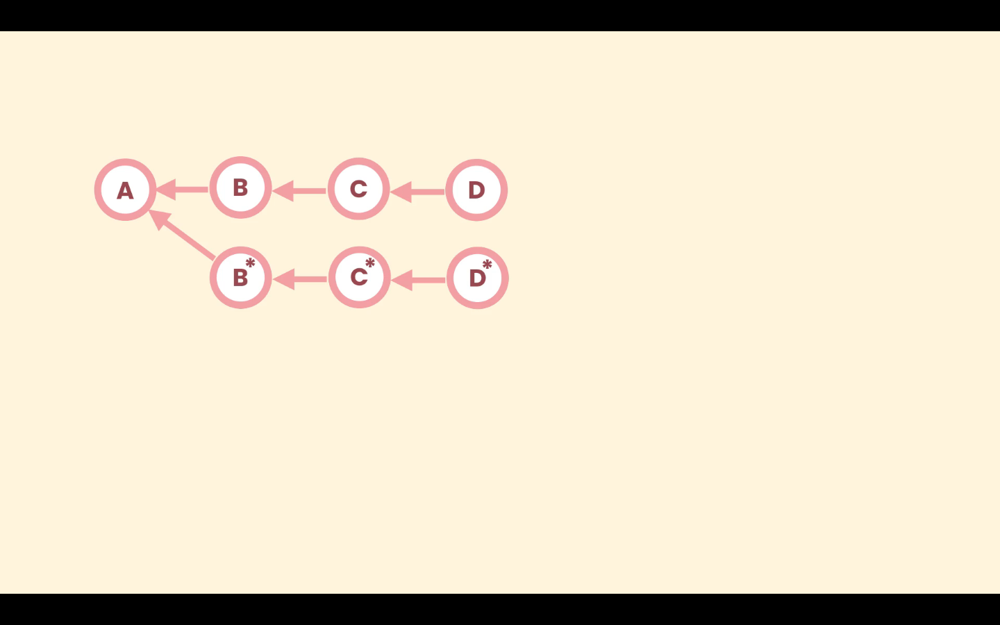

# Git interactive rebase

Git interactive rebase provides more manual control on the history revision process. It helps to optimize and clean up the history.

It covers several usecases like:
- Editing a commit message
- Dropping a commit
- Squashing/combining multiple commits
- Change/Modify a  commit snapshot
- Split/repon a commits for editing

With interactive rebasing we can replay other commits on top of a commit. First we choose the commit we need to modify and pass it parent to the `rebase` command with the `-i` option.

```shell
git rebase -i <commit>
```
The `-i` option means we are going to interact with the rebase operation, stop it, make changes, continue it or abort it.

We can modify one or more commits. Git will recreate each commit that goes through the rebase operation even if they are not edited.

Consider a repository with commit `A`, `B`, `C` and `D`.


In the above image suppose we only changed commit `B` resulting int `B*` (since commits in git are immutable), Git will recreate `C*` to point `B*` and `D*` to point `C*`. Since the base commit got changed, the further commits will also be changed<br>
Then the previous commits `B`, `C` and `D` will be discarded.

During interactive rebase, we specify a point on a branch's history. And then all the commits that come after that point point are presented in a rebase script for following allowed operations:
- Pick : kepp the commit as it is currently in the history
- Drop: remove the commit completely from the history
- Sqush: combine the commit with one before it
- Reword: change the commit message
Once the selection are made for each commit (from the above specified ones), Git moves commit by commit from the oldest to the newest attempting the apply the requested changes.

**Just like `git reset` the interactive rebase also rewrites history. So it should be avoided on the publically shared commits.**